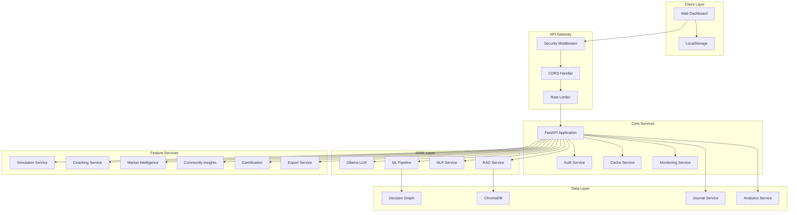
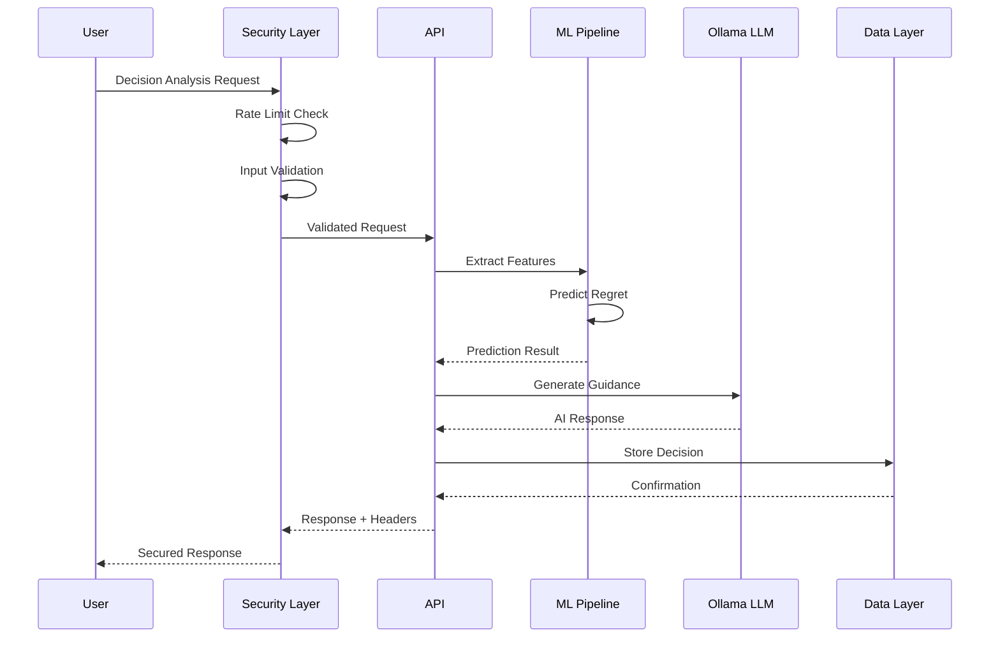
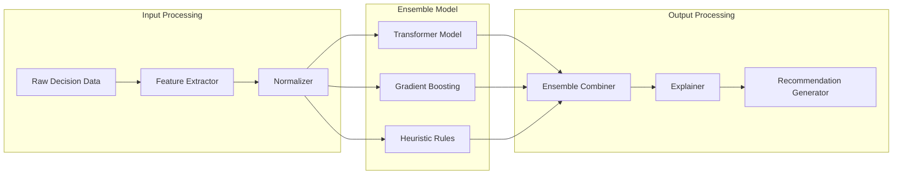

# Career Decision Regret AI

An intelligent career decision analysis system that helps users evaluate career choices, predict potential regret, and receive personalized guidance using machine learning and AI.

## System Architecture



## Request Flow



## ML Pipeline Architecture



## Features

### Core Analysis
- Decision regret prediction using ensemble ML (Transformer + Gradient Boosting)
- Natural language processing for sentiment and intent analysis
- Knowledge graph for decision pattern analysis
- RAG-powered contextual responses

### Media Ingestion
- YouTube video extraction and transcript processing
- URL content scraping and analysis
- Local video file upload and metadata extraction
- Automatic system training on media content
- Media knowledge base indexing with RAG

### Decision Journal
- Track and log career decisions
- Automated follow-up reminders at 30, 90, and 180 days
- Record actual outcomes and compare with predictions
- Prediction accuracy tracking

### Career Path Simulation
- Monte Carlo simulations for career trajectories
- 5-year salary and satisfaction projections
- Scenario comparison tools
- Risk analysis metrics

### Personalized Coaching
- Cognitive bias detection (loss aversion, sunk cost, etc.)
- Decision-making style analysis
- Strength and weakness identification
- Personalized action items

### Market Intelligence
- Salary benchmarking across 15+ roles and 16 locations
- Industry trend analysis
- Skills gap assessment
- Job market health indicators

### Community Insights
- Anonymized decision patterns from similar users
- Success rate statistics
- Community wisdom and learnings

### Gamification
- Points and leveling system
- 13 achievements across categories
- Daily challenges and streaks

## Technology Stack

| Layer | Technologies |
|-------|-------------|
| Backend | Python 3.11, FastAPI, Uvicorn |
| ML/DL | PyTorch, scikit-learn, Transformers |
| NLP | sentence-transformers, spaCy |
| LLM | Ollama (llama3.2) |
| Vector DB | ChromaDB |
| Graph | NetworkX |
| Media | yt-dlp, youtube-transcript-api, BeautifulSoup4, OpenCV |
| Security | PBKDF2, JWT, CORS |
| Database | SQLAlchemy, SQLite |

## Installation

### Prerequisites
- Python 3.11+
- Ollama (optional, for AI chat)

### Setup

```bash
git clone https://github.com/yourusername/career-decision-ai.git
cd career-decision-ai

python -m venv venv
source venv/bin/activate

pip install -r requirements.txt

ollama serve
ollama pull llama3.2

python main.py
```

Open browser: http://localhost:8000

## Configuration

| Variable | Description | Default |
|----------|-------------|---------|
| HOST | Server host | 0.0.0.0 |
| PORT | Server port | 8000 |
| DEBUG | Debug mode | false |
| OLLAMA_BASE_URL | Ollama API URL | http://localhost:11434 |
| OLLAMA_MODEL | LLM model | llama3.2 |
| JWT_SECRET_KEY | JWT signing key | auto-generated |
| CORS_ORIGINS | Allowed origins | localhost |
| RATE_LIMIT_RPM | Requests/minute | 30 |

## API Endpoints

### Core
| Endpoint | Method | Description |
|----------|--------|-------------|
| `/` | GET | Web dashboard |
| `/api/health` | GET | System health |
| `/api/analyze` | POST | Analyze decision |
| `/api/chat` | POST | AI chat |

### Media Ingestion
| Endpoint | Method | Description |
|----------|--------|-------------|
| `/api/upload/url` | POST | Process URL/YouTube link |
| `/api/upload/video` | POST | Upload video file |
| `/api/media/{user_id}` | GET | List user's media |
| `/api/media/info/{media_id}` | GET | Get media details |
| `/api/media/{media_id}` | DELETE | Delete media |
| `/api/media-stats/{user_id}` | GET | View media statistics |

### Journal
| Endpoint | Method | Description |
|----------|--------|-------------|
| `/api/journal/create` | POST | Create entry |
| `/api/journal/{user_id}` | GET | Get entries |
| `/api/journal/{user_id}/statistics` | GET | Get stats |
| `/api/journal/{user_id}/insights` | GET | Get insights |

### Analytics & Simulation
| Endpoint | Method | Description |
|----------|--------|-------------|
| `/api/analytics/{user_id}` | GET | User analytics |
| `/api/simulation/run` | POST | Run simulation |
| `/api/simulation/compare` | POST | Compare scenarios |

### Market & Community
| Endpoint | Method | Description |
|----------|--------|-------------|
| `/api/market/salary` | GET | Salary data |
| `/api/community/social-proof/{type}` | GET | Social proof |

## Project Structure

```
project3/
├── main.py                         # FastAPI application
├── config.py                       # Configuration
├── requirements.txt                # Dependencies
├── README.md                       # This file
├── SECURITY.md                     # Security documentation
├── MEDIA_INGESTION_FEATURE.md      # Media ingestion detailed guide
├── MEDIA_INGESTION_QUICK_GUIDE.md  # Media ingestion quick reference
├── models/
│   ├── README.md                   # ML models architecture & design
│   ├── ml_pipeline.py              # Transformer + ML models
│   ├── graph_engine.py             # Decision knowledge graph
│   └── database.py                 # Database models
├── services/
│   ├── README.md                   # Microservices architecture & patterns
│   ├── security.py                 # Security (auth, rate limiting)
│   ├── ollama_service.py           # LLM integration
│   ├── rag_service.py              # RAG with ChromaDB
│   ├── nlp_service.py              # NLP analysis
│   ├── journal_service.py          # Decision journal
│   ├── file_upload_service.py      # File & media upload
│   ├── media_ingestion_service.py  # Media processing (YouTube, URL, video)
│   ├── simulation_service.py       # Career simulation
│   ├── coaching_service.py         # Personalized coaching
│   ├── market_intelligence_service.py
│   ├── community_insights_service.py
│   ├── gamification_service.py     # Gamification system
│   ├── export_service.py           # Export functionality
│   ├── analytics.py                # Analytics engine
│   ├── humanizer.py                # Response humanization
│   ├── feedback_service.py         # Feedback collection
│   └── [40+ additional services]   # Multi-layer architecture
├── tests/
│   ├── README.md                   # Testing guide & architecture
│   ├── conftest.py                 # Pytest fixtures
│   ├── test_imports.py
│   ├── test_api_integration.py     # API integration tests
│   ├── test_bias_interceptor.py
│   ├── test_data_privacy.py
│   ├── test_future_self.py
│   ├── test_global_regret_db.py
│   ├── test_opportunity_scout.py
│   ├── test_phase2_services.py
│   ├── test_youtube_service.py
│   └── [additional test files]
├── chroma_db/                      # Vector database storage
└── uploads/                        # User file uploads
```

## Documentation

This project includes comprehensive documentation for different areas:

### Architecture & Design
- **[models/README.md](models/README.md)** - ML pipeline architecture, graph engine design, database models with Mermaid diagrams
- **[services/README.md](services/README.md)** - Microservices architecture, 50+ service definitions, communication patterns with dependency graphs
- **[tests/README.md](tests/README.md)** - Testing framework, test organization, fixtures, CI/CD integration

### Feature Guides
- **[MEDIA_INGESTION_FEATURE.md](MEDIA_INGESTION_FEATURE.md)** - Comprehensive media ingestion feature documentation
- **[MEDIA_INGESTION_QUICK_GUIDE.md](MEDIA_INGESTION_QUICK_GUIDE.md)** - Quick reference for media features

### Security
- **[SECURITY.md](SECURITY.md)** - Security features, configuration, and best practices

## Security

See [SECURITY.md](SECURITY.md) for security features, configuration, and best practices.

## License

MIT License. See LICENSE file.

## Contributing

1. Fork the repository
2. Create a feature branch
3. Make changes
4. Submit a pull request