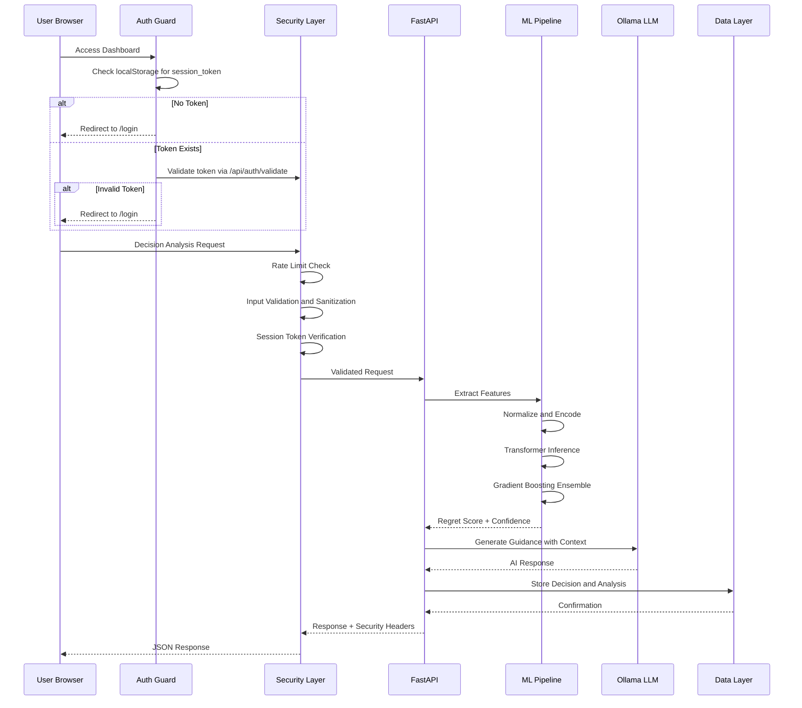
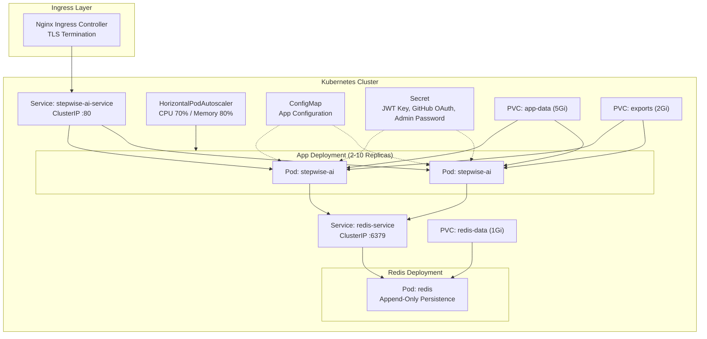
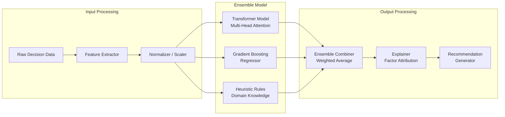
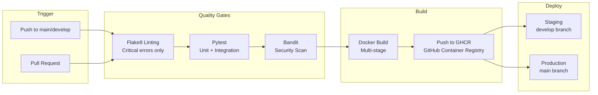

# StepWise AI

An intelligent career decision analysis system that helps users evaluate career choices, predict potential regret, and receive personalized guidance using machine learning and AI.

---

## The Problem

Career decisions are among the most consequential choices people make, yet they are often made under uncertainty, time pressure, and emotional stress. Research shows that:

- **72% of professionals** report experiencing regret over at least one major career decision.
- People spend an average of **just 14 hours** researching a career change that will affect the next 5-10 years of their life.
- **Cognitive biases** like sunk cost fallacy, confirmation bias, and anchoring distort decision-making, often without the person being aware of it.
- Existing career advice is **fragmented** -- scattered across generic articles, expensive coaching sessions, and anecdotal advice from peers who may have fundamentally different circumstances.
- There is **no feedback loop** in career decisions. People make a choice, move on, and never systematically learn from the outcome to improve future decisions.

The result is a cycle of uninformed decisions, avoidable regret, and missed opportunities. There is no tool that combines structured analysis, bias detection, outcome prediction, and continuous learning into a single system.

## Why This Was Built

StepWise AI was built to bridge the gap between how important career decisions are and how poorly they are typically made. The goal is to give every person access to the kind of rigorous, data-driven analysis that was previously available only through expensive career coaches or business consultants.

This system addresses the problem from multiple angles:

- **Predict before you regret.** A transformer-based ML model analyzes your decision context, personal profile, and market conditions to estimate regret probability before you commit.
- **Detect your blind spots.** A real-time bias interceptor identifies cognitive biases (sunk cost, anchoring, overconfidence, confirmation bias) in your reasoning and suggests corrective thinking.
- **Simulate outcomes.** Monte Carlo simulations project 5-year career trajectories across salary, satisfaction, and growth dimensions so you can compare paths quantitatively.
- **Learn from history.** The outcome learning service tracks what actually happened after past decisions and feeds that data back into the prediction model, improving accuracy over time.
- **Get AI-powered guidance.** An integrated LLM (Ollama/llama3.2) acts as a career counselor, enriched with RAG context from a knowledge base of career patterns, market data, and your own history.

## Why Use This Over Alternatives

| Consideration | Generic Career Advice | Career Coach | StepWise AI |
|---------------|----------------------|-------------|--------------------------|
| Cost | Free (low quality) | $100-500/session | Free and self-hosted |
| Personalization | None | High (but subjective) | High (data-driven) |
| Bias detection | None | Depends on coach | Automated, real-time |
| Outcome tracking | None | Rarely | Built-in feedback loop |
| Market data | Generic articles | Coach experience | Benchmarked across 15+ roles, 16 locations |
| Simulation | None | None | Monte Carlo projections |
| Availability | Search-dependent | Appointment-based | 24/7, local-first |
| Privacy | Data sold to advertisers | Shared with coach | Runs entirely on your machine |
| Continuous learning | None | None | Model improves from your outcomes |

Key differentiators:

- **Fully local and private.** The entire system runs on your machine. No data leaves your computer. The LLM runs locally via Ollama.
- **Bias-aware.** The system actively detects and flags cognitive biases in your reasoning, which no static advice article can do.
- **Quantitative.** Instead of vague advice like "follow your passion," you get regret scores (0-100), confidence intervals, and simulated salary trajectories.
- **Adaptive.** The system learns from your outcomes. The more decisions you track, the better its predictions become for your specific profile.
- **Production-grade architecture.** JWT authentication, rate limiting, brute force protection, PBKDF2 password hashing, security headers, Kubernetes-ready deployment. This is not a toy project.

## Quick Start Guide

Get the system running in under 5 minutes:

**Step 1: Clone and install**
```bash
git clone https://github.com/sayon999-d/StepwiseAI.git
cd StepwiseAI
python -m venv venv
source venv/bin/activate
pip install -r requirements.txt
```

**Step 2: Configure environment**
```bash
cat > .env << EOF
JWT_SECRET_KEY=$(python3 -c "import secrets; print(secrets.token_hex(32))")
GITHUB_CLIENT_ID=
GITHUB_CLIENT_SECRET=
GITHUB_REDIRECT_URI=http://localhost:8000/api/auth/github/callback
EOF
```

**Step 3: Start Ollama (for AI chat)**
```bash
ollama serve &
ollama pull llama3.2
```

**Step 4: Launch the application**
```bash
python main.py
```

**Step 5: Open in browser**
```
http://localhost:8000
```

You will see the login page. Create an account (signup), then start:

- **Chat** -- talk to the AI career counselor about any decision
- **Quick Guide** -- in-app documentation with feature explanations, API codes, and quick-start links
- **Decision Analysis** -- submit a structured decision for ML-powered regret prediction
- **Resume Analysis** -- upload your resume to get skills gap analysis
- **History** -- review past conversations and decisions
- **Simulation** -- run Monte Carlo simulations to compare career paths
- **Templates** -- use structured frameworks for common decisions (job offers, career switches, education)
- **Scenario Builder** -- "what if" simulations with multi-year projections
- **Career Feed** -- personalized salary trends, skills, and market intelligence
- **Peer Insights** -- anonymous benchmarking against similar professionals
- **Decision Frameworks** -- structured rubrics (BATNA, job offers, career pivots)
- **Career Timeline** -- visual milestone tracking and progress reports
- **SMART Goals** -- goal tracker with AI-generated sub-tasks and accountability
- **Reversal Analyzer** -- assess if a regretted decision can still be reversed
- **Culture Lens** -- compare work cultures and salary PPP across countries

All features except AI chat work offline. The system degrades gracefully when Ollama is not running.

---

## System Architecture


```mermaid
graph TB
    subgraph Client["Client Layer"]
        UI["Web Dashboard<br/>Single-Page Application"]
        LS["LocalStorage<br/>Session, Preferences, History"]
    end

    subgraph Gateway["API Gateway"]
        SEC["Security Middleware<br/>Input Validation, XSS Prevention"]
        CORS["CORS Handler"]
        RL["Rate Limiter<br/>Token Bucket Algorithm"]
        BF["Brute Force Protector"]
    end

    subgraph Core["Core Services"]
        API["FastAPI Application<br/>Async Request Handling"]
        AUTH["HardenedAuthService<br/>JWT, Sessions, OAuth"]
        CACHE["Cache Service<br/>LRU with TTL"]
        MON["Monitoring Service<br/>Health, Metrics"]
    end

    subgraph AI["AI and ML Layer"]
        OLLAMA["Ollama LLM<br/>llama3.2"]
        ML["ML Pipeline<br/>Transformer + Gradient Boosting"]
        NLP["NLP Service<br/>Intent, Sentiment, Emotion"]
        RAG["RAG Service<br/>ChromaDB + SentenceTransformers"]
    end

    subgraph Data["Data Layer"]
        GRAPH["Decision Graph<br/>NetworkX"]
        CHROMA["ChromaDB<br/>Vector Store"]
        DB["SQLite<br/>User, Decision, Analysis"]
        REDIS["Redis<br/>Session Cache"]
    end

    subgraph Features["Feature Services"]
        SIM["Simulation<br/>Monte Carlo"]
        COACH["Coaching<br/>Bias Detection"]
        MARKET["Market Intelligence<br/>Salary, Trends"]
        RESUME["Resume Analysis<br/>Parser, Skills"]
        EXPORT["Export<br/>JSON, PDF, Text"]
        GAMIFY["Gamification<br/>Points, Achievements"]
    end

    subgraph CareerIntel["Career Intelligence"]
        SCENARIO["Scenario Builder<br/>What-If Simulations"]
        FEED["Career Feed<br/>Personalized Intel"]
        PEER["Peer Insights<br/>Anonymous Benchmarking"]
        FRAMEWORK["Decision Frameworks<br/>Structured Rubrics"]
        TIMELINE["Career Timeline<br/>Milestone Tracking"]
        GOALS["SMART Goals<br/>Accountability Tracker"]
        REVERSAL["Reversal Analyzer<br/>Undo Decisions"]
        CULTURE["Culture Lens<br/>Cross-Country Compare"]
    end

    UI --> SEC
    SEC --> CORS
    CORS --> RL
    RL --> BF
    BF --> API

    API --> AUTH
    API --> CACHE
    API --> MON

    API --> OLLAMA
    API --> ML
    API --> NLP
    API --> RAG

    ML --> GRAPH
    RAG --> CHROMA
    API --> DB
    AUTH --> REDIS

    API --> SIM
    API --> COACH
    API --> MARKET
    API --> RESUME
    API --> EXPORT
    API --> GAMIFY

    API --> SCENARIO
    API --> FEED
    API --> PEER
    API --> FRAMEWORK
    API --> TIMELINE
    API --> GOALS
    API --> REVERSAL
    API --> CULTURE

    UI --> LS
```

## Request Flow


```mermaid
sequenceDiagram
    participant U as User Browser
    participant AG as Auth Guard
    participant S as Security Layer
    participant A as FastAPI
    participant ML as ML Pipeline
    participant LLM as Ollama LLM
    participant DB as Data Layer

    U->>AG: Access Dashboard
    AG->>AG: Check localStorage for session_token
    alt No Token
        AG-->>U: Redirect to /login
    else Token Exists
        AG->>S: Validate token via /api/auth/validate
        alt Invalid Token
            AG-->>U: Redirect to /login
        end
    end

    U->>S: Decision Analysis Request
    S->>S: Rate Limit Check
    S->>S: Input Validation and Sanitization
    S->>S: Session Token Verification
    S->>A: Validated Request

    A->>ML: Extract Features
    ML->>ML: Normalize and Encode
    ML->>ML: Transformer Inference
    ML->>ML: Gradient Boosting Ensemble
    ML-->>A: Regret Score + Confidence

    A->>LLM: Generate Guidance with Context
    LLM-->>A: AI Response

    A->>DB: Store Decision and Analysis
    DB-->>A: Confirmation

    A-->>S: Response + Security Headers
    S-->>U: JSON Response
```

## Deployment Architecture (Kubernetes)


```mermaid
graph TB
    subgraph Ingress["Ingress Layer"]
        ING["Nginx Ingress Controller<br/>TLS Termination"]
    end

    subgraph K8s["Kubernetes Cluster"]
        subgraph AppDeploy["App Deployment (2-10 Replicas)"]
            POD1["Pod: stepwise-ai"]
            POD2["Pod: stepwise-ai"]
        end

        subgraph RedisDeploy["Redis Deployment"]
            RPOD["Pod: redis<br/>Append-Only Persistence"]
        end

        SVC_APP["Service: stepwise-ai-service<br/>ClusterIP :80"]
        SVC_REDIS["Service: redis-service<br/>ClusterIP :6379"]

        HPA["HorizontalPodAutoscaler<br/>CPU 70% / Memory 80%"]

        CM["ConfigMap<br/>App Configuration"]
        SEC["Secret<br/>JWT Key, GitHub OAuth, Admin Password"]

        PVC_DATA["PVC: app-data (5Gi)"]
        PVC_EXPORT["PVC: exports (2Gi)"]
        PVC_REDIS["PVC: redis-data (1Gi)"]
    end

    ING --> SVC_APP
    SVC_APP --> POD1
    SVC_APP --> POD2
    SVC_REDIS --> RPOD

    POD1 --> SVC_REDIS
    POD2 --> SVC_REDIS

    HPA --> AppDeploy

    CM -.-> POD1
    CM -.-> POD2
    SEC -.-> POD1
    SEC -.-> POD2

    PVC_DATA --> POD1
    PVC_DATA --> POD2
    PVC_EXPORT --> POD1
    PVC_EXPORT --> POD2
    PVC_REDIS --> RPOD
```

## ML Pipeline Architecture


```mermaid
graph LR
    subgraph Input["Input Processing"]
        RAW["Raw Decision Data"]
        FE["Feature Extractor"]
        NORM["Normalizer / Scaler"]
    end

    subgraph Model["Ensemble Model"]
        TRANS["Transformer Model<br/>Multi-Head Attention"]
        GB["Gradient Boosting<br/>Regressor"]
        HEUR["Heuristic Rules<br/>Domain Knowledge"]
    end

    subgraph Output["Output Processing"]
        ENS["Ensemble Combiner<br/>Weighted Average"]
        EXP["Explainer<br/>Factor Attribution"]
        REC["Recommendation<br/>Generator"]
    end

    RAW --> FE
    FE --> NORM
    NORM --> TRANS
    NORM --> GB
    NORM --> HEUR

    TRANS --> ENS
    GB --> ENS
    HEUR --> ENS

    ENS --> EXP
    EXP --> REC
```

## Features

### Core Analysis
- Decision regret prediction using ensemble ML (Transformer + Gradient Boosting)
- Natural language processing for sentiment and intent analysis
- Knowledge graph for decision pattern analysis
- RAG-powered contextual responses via ChromaDB

### Authentication and Security
- Username/password authentication with PBKDF2-SHA256 hashing
- GitHub OAuth integration
- Client-side auth guard with server-side token validation
- Rate limiting, brute force protection, IP management
- Security headers (CSP, HSTS, X-Frame-Options)

### Chat and Conversation
- AI-powered career counselor using Ollama (llama3.2)
- Multi-turn conversation support
- Automatic conversation history saving to journal
- File and resume upload context
- Task complexity classification for token optimization

### Quick Guide
- In-app documentation accessible from the sidebar
- Detailed feature explanations with "What it does" and "How it works" sections
- API endpoint code blocks for every feature
- Quick-start navigation buttons to jump directly to any feature
- Organized by sections: Core Features, Tools, New Features, Operations

### Resume Analysis
- PDF and document parsing
- Skills extraction and gap analysis
- Experience and education parsing
- ATS compatibility scoring
- Job matching recommendations

### Decision Journal and History
- Track and log career decisions and conversations
- Automated follow-up reminders at 30, 90, and 180 days
- Record actual outcomes and compare with predictions
- Prediction accuracy tracking

### Career Path Simulation
- Monte Carlo simulations for career trajectories
- 5-year salary and satisfaction projections
- Scenario comparison tools
- Risk analysis metrics

### Market Intelligence
- Salary benchmarking across 15+ roles and 16 locations
- Industry trend analysis
- Skills gap assessment
- Job market health indicators

### Scenario Builder (New)
- Natural language "what if" scenario input
- Monte Carlo simulations with 1000+ iterations
- Multi-variable projections: salary, satisfaction, growth
- Scenario chaining for sequential decisions
- Side-by-side comparison of multiple scenarios

### Career Feed (New)
- Personalized career intelligence feed
- Content types: salary trends, skill gaps, industry news, opportunities
- Relevance scoring and user preference tuning
- Bookmark, dismiss, and engagement tracking

### Peer Insights (New)
- Anonymous peer registration by role, industry, and experience
- Cohort matching and benchmarking
- Decision pattern and regret distribution analysis
- Data contribution for community enrichment

### Decision Frameworks (New)
- Six structured decision rubrics:
  - Job Offer Evaluator
  - BATNA Analyzer
  - Career Pivot Scorecard
  - Promotion Readiness
  - Startup Risk Evaluator
  - Remote Work Fit
- Per-dimension slider scoring with AI-generated analysis

### Career Timeline (New)
- Visual milestone tracking (decisions, achievements, role changes, salary changes)
- Metric snapshots over time
- Progress report generation with velocity metrics
- Export in JSON and Markdown

### SMART Goals (New)
- Goal creation with AI-generated sub-tasks (3-7 per goal)
- Categories: career, skill, financial, network, education
- Progress check-ins with status tracking
- Weekly accountability report generation
- Goal templates for common objectives

### Reversal Analyzer (New)
- Decision reversibility scoring (0-100)
- Cost breakdown: financial, career, emotional, opportunity
- Time-decay modeling
- Step-by-step reversal roadmap
- Partial correction alternatives

### Culture Lens (New)
- Hofstede cultural dimension comparison
- Career norms by country (resume gaps, work hours, referrals)
- Salary purchasing power parity (PPP) calculator
- Side-by-side country comparison

### Additional Features
- Personalized coaching with cognitive bias detection
- Community insights with anonymized decision patterns
- Gamification with points, levels, and 13 achievements
- Interview practice with AI-powered mock sessions
- Data export in JSON, PDF, and Text formats
- Dark mode toggle
- Voice input support (Whisper STT)

## Dashboard Layout

The web dashboard is a single-page application with a sidebar navigation and tabbed content area:

| Section | Tabs |
|---------|------|
| **Workspace** | Chat, Quick Guide, Templates, History |
| **Tools** | Graph View, Analytics, Resume Analysis, Outcome Simulation, Interview Practice |
| **Advanced** | Goals, Opportunities, Mentor Matching, Privacy |
| **New Features** | Scenario Builder, Career Feed, Peer Insights, Frameworks, Timeline, Smart Goals, Reversal Analyzer, Culture Lens |
| **Operations** | System Status, Calendar, Integrations |

The **Quick Guide** tab serves as an in-app reference, documenting every feature with descriptions, technical explanations, API endpoints, and quick-start buttons.

## Technology Stack

| Layer | Technologies |
|-------|-------------|
| Backend | Python 3.11, FastAPI, Uvicorn |
| ML/DL | PyTorch, scikit-learn, Transformers |
| NLP | sentence-transformers, spaCy |
| LLM | Ollama (llama3.2) |
| Vector DB | ChromaDB |
| Graph | NetworkX |
| Auth | PBKDF2-SHA256, JWT, GitHub OAuth |
| Database | SQLAlchemy, SQLite |
| Cache | Redis |
| Container | Docker, Kubernetes |
| CI/CD | GitHub Actions, GHCR |

## Installation

### Prerequisites
- Python 3.11+
- Ollama (for AI chat features)

### Local Setup

```bash
git clone https://github.com/sayon999-d/StepwiseAI.git
cd StepwiseAI

python -m venv venv
source venv/bin/activate

pip install -r requirements.txt

# Create .env file
cat > .env << EOF
JWT_SECRET_KEY=$(python3 -c "import secrets; print(secrets.token_hex(32))")
GITHUB_CLIENT_ID=your_github_client_id
GITHUB_CLIENT_SECRET=your_github_client_secret
GITHUB_REDIRECT_URI=http://localhost:8000/api/auth/github/callback
EOF

# Start Ollama
ollama serve &
ollama pull llama3.2

# Start application
python main.py
```

Open browser: http://localhost:8000

### Kubernetes Deployment

```bash
# Build and push Docker image
docker build -t ghcr.io/sayon999-d/StepwiseAI:latest .
docker push ghcr.io/sayon999-d/StepwiseAI:latest

# Update secrets in k8s/secrets.yaml with real values

# Deploy to cluster
kubectl apply -f k8s/namespace.yaml
kubectl apply -f k8s/secrets.yaml
kubectl apply -f k8s/configmap.yaml
kubectl apply -f k8s/pvc.yaml
kubectl apply -f k8s/deployment.yaml
kubectl apply -f k8s/service.yaml
kubectl apply -f k8s/ingress.yaml
kubectl apply -f k8s/hpa.yaml
```

## Configuration

| Variable | Description | Default |
|----------|-------------|---------|
| HOST | Server host | 127.0.0.1 |
| PORT | Server port | 8000 |
| DEBUG | Debug mode | true |
| OLLAMA_BASE_URL | Ollama API URL | http://localhost:11434 |
| OLLAMA_MODEL | LLM model | llama3.2 |
| JWT_SECRET_KEY | JWT signing key | auto-generated |
| GITHUB_CLIENT_ID | GitHub OAuth client ID | None |
| GITHUB_CLIENT_SECRET | GitHub OAuth client secret | None |
| GITHUB_REDIRECT_URI | GitHub OAuth callback URL | http://localhost:8000/api/auth/github/callback |
| CORS_ORIGINS | Allowed origins | localhost |
| RATE_LIMIT_RPM | Requests per minute | 30 |
| MAX_LOGIN_ATTEMPTS | Login attempts before lockout | 5 |
| LOCKOUT_DURATION_MINUTES | Account lockout duration | 15 |

## API Endpoints

### Authentication
| Endpoint | Method | Description |
|----------|--------|-------------|
| `/login` | GET | Login page |
| `/signup` | GET | Signup page |
| `/api/auth/register` | POST | Register new user |
| `/api/auth/login` | POST | Login and get session token |
| `/api/auth/validate` | GET | Validate session token |
| `/api/auth/logout` | POST | Invalidate session |
| `/api/auth/github` | GET | GitHub OAuth redirect |
| `/api/auth/github/callback` | GET | GitHub OAuth callback |

### Core
| Endpoint | Method | Description |
|----------|--------|-------------|
| `/` | GET | Web dashboard |
| `/api/health` | GET | System health |
| `/api/analyze` | POST | Analyze decision |
| `/api/chat` | POST | AI chat |

### Media and Upload
| Endpoint | Method | Description |
|----------|--------|-------------|
| `/api/upload` | POST | Upload file (resume, document) |
| `/api/upload/url` | POST | Process URL or YouTube link |
| `/api/upload/video` | POST | Upload video file |

### Journal and Analytics
| Endpoint | Method | Description |
|----------|--------|-------------|
| `/api/journal/create` | POST | Create journal entry |
| `/api/journal/{user_id}` | GET | Get journal entries |
| `/api/analytics/{user_id}` | GET | User analytics |
| `/api/simulation/run` | POST | Run career simulation |

### Resume
| Endpoint | Method | Description |
|----------|--------|-------------|
| `/api/resume/parse` | POST | Parse resume text |
| `/api/resume/{resume_id}` | GET | Get parsed resume data |

### Scenario Builder
| Endpoint | Method | Description |
|----------|--------|-------------|
| `/api/scenario/create` | POST | Create what-if scenario |
| `/api/scenario/chain` | POST | Chain scenarios sequentially |
| `/api/scenario/compare` | POST | Compare multiple scenarios |
| `/api/scenario/list/{user_id}` | GET | List user scenarios |

### Career Feed
| Endpoint | Method | Description |
|----------|--------|-------------|
| `/api/feed/preferences/{user_id}` | POST | Set feed preferences |
| `/api/feed/{user_id}` | GET | Get personalized feed |
| `/api/feed/read/{user_id}/{item_id}` | POST | Mark item as read |
| `/api/feed/bookmark/{user_id}/{item_id}` | POST | Bookmark item |
| `/api/feed/dismiss/{user_id}/{item_id}` | POST | Dismiss item |
| `/api/feed/bookmarks/{user_id}` | GET | Get bookmarked items |
| `/api/feed/stats/{user_id}` | GET | Feed engagement stats |

### Peer Insights
| Endpoint | Method | Description |
|----------|--------|-------------|
| `/api/peers/register` | POST | Register peer profile |
| `/api/peers/comparison/{user_id}` | GET | Get peer comparison |
| `/api/peers/contribute` | POST | Contribute decision data |
| `/api/peers/distribution/{user_id}/{decision_type}` | GET | Get peer distributions |

### Decision Frameworks
| Endpoint | Method | Description |
|----------|--------|-------------|
| `/api/frameworks/list` | GET | List available frameworks |
| `/api/frameworks/start` | POST | Start framework evaluation |
| `/api/frameworks/score` | POST | Score framework dimensions |
| `/api/frameworks/quick-score` | POST | Quick score with AI analysis |
| `/api/frameworks/history/{user_id}` | GET | Get evaluation history |

### Career Timeline
| Endpoint | Method | Description |
|----------|--------|-------------|
| `/api/timeline/milestone` | POST | Add milestone |
| `/api/timeline/metric-snapshot` | POST | Record metric snapshot |
| `/api/timeline/{user_id}` | GET | Get timeline |
| `/api/timeline/report/{user_id}` | GET | Get progress report |
| `/api/timeline/export/{user_id}` | GET | Export timeline |

### SMART Goals
| Endpoint | Method | Description |
|----------|--------|-------------|
| `/api/goals/create` | POST | Create SMART goal |
| `/api/goals/{user_id}` | GET | List active goals |
| `/api/goals/{user_id}/{goal_id}` | GET | Get goal details |
| `/api/goals/subtask/complete` | POST | Complete sub-task |
| `/api/goals/checkin` | POST | Goal check-in |
| `/api/goals/accountability/{user_id}` | GET | Accountability report |
| `/api/goals/templates` | GET | Goal templates |

### Reversal Analyzer
| Endpoint | Method | Description |
|----------|--------|-------------|
| `/api/reversal/analyze` | POST | Analyze reversibility |
| `/api/reversal/history/{user_id}` | GET | Past reversal analyses |

### Culture Lens
| Endpoint | Method | Description |
|----------|--------|-------------|
| `/api/culture/countries` | GET | Supported countries |
| `/api/culture/profile/{country_code}` | GET | Country cultural profile |
| `/api/culture/adapt-advice` | POST | Culture-aware career advice |
| `/api/culture/adjust-salary` | POST | PPP salary conversion |
| `/api/culture/set-locale` | POST | Set user locale |
| `/api/culture/compare/{country_a}/{country_b}` | GET | Compare two countries |
| `/api/culture/detect-language` | GET | Detect user language |

## Project Structure

```
StepwiseAI/
├── main.py                           FastAPI application (single-file dashboard + API)
├── config.py                         Configuration (pydantic BaseSettings)
├── requirements.txt                  Python dependencies
├── Dockerfile                        Multi-stage production Docker image
├── .env                              Environment variables (not committed)
├── .github/
│   └── workflows/
│       └── ci-cd.yml                 CI/CD pipeline (lint, test, build, deploy)
├── k8s/                              Kubernetes manifests
│   ├── namespace.yaml                Namespace definition
│   ├── configmap.yaml                Application configuration
│   ├── secrets.yaml                  Sensitive credentials
│   ├── deployment.yaml               App (2 replicas) + Redis deployments
│   ├── service.yaml                  ClusterIP services
│   ├── pvc.yaml                      Persistent volume claims
│   ├── ingress.yaml                  Nginx ingress with TLS
│   └── hpa.yaml                      Horizontal pod autoscaler
├── models/
│   ├── ml_pipeline.py                Transformer + Gradient Boosting models
│   ├── graph_engine.py               Decision knowledge graph (NetworkX)
│   └── database.py                   SQLAlchemy ORM models
├── services/                         65+ microservice modules
│   ├── __init__.py                   Service exports and initialization
│   ├── security.py                   Auth, rate limiting, brute force protection
│   ├── ollama_service.py             LLM integration
│   ├── rag_service.py                RAG with ChromaDB
│   ├── nlp_service.py                NLP analysis
│   ├── journal_service.py            Decision journal
│   ├── file_upload_service.py        File and media upload
│   ├── resume_parser_service.py      Resume parsing and analysis
│   ├── simulation_service.py         Career path simulation
│   ├── coaching_service.py           Personalized coaching
│   ├── market_intelligence_service.py Salary benchmarking, trends
│   ├── community_insights_service.py  Anonymized community data
│   ├── gamification_service.py       Points and achievements
│   ├── export_service.py             Data export (JSON, PDF, Text)
│   ├── analytics.py                  Analytics engine
│   ├── scenario_builder_service.py   What-if Monte Carlo simulations
│   ├── career_feed_service.py        Personalized career intelligence
│   ├── peer_comparison_service.py    Anonymous peer benchmarking
│   ├── decision_framework_service.py Decision rubrics (BATNA, etc.)
│   ├── career_timeline_service.py    Career milestone timeline
│   ├── goal_tracking_service.py      SMART goal tracker
│   ├── reversal_analyzer_service.py  Decision reversibility analysis
│   ├── multilingual_service.py       i18n and locale support
│   ├── pwa_service.py                Progressive Web App support
│   └── ...                           40+ additional service modules
├── tests/
│   ├── conftest.py                   Pytest fixtures
│   ├── test_imports.py               Service import validation
│   ├── test_api_integration.py       API integration tests
│   └── ...                           Additional test modules
├── docs/
│   ├── README.md                     Documentation index
│   └── API.md                        Full API reference
├── SECURITY.md                       Security documentation
└── LICENSE                           MIT License
```

## CI/CD Pipeline


```mermaid
graph LR
    subgraph Trigger["Trigger"]
        PUSH["Push to main/develop"]
        PR["Pull Request"]
    end

    subgraph Quality["Quality Gates"]
        LINT["Flake8 Linting<br/>Critical errors only"]
        TEST["Pytest<br/>Unit + Integration"]
        SEC["Bandit<br/>Security Scan"]
    end

    subgraph Build["Build"]
        DOCKER["Docker Build<br/>Multi-stage"]
        GHCR["Push to GHCR<br/>GitHub Container Registry"]
    end

    subgraph Deploy["Deploy"]
        STAGING["Staging<br/>develop branch"]
        PROD["Production<br/>main branch"]
    end

    PUSH --> LINT
    PR --> LINT
    LINT --> TEST
    TEST --> SEC
    SEC --> DOCKER
    DOCKER --> GHCR
    GHCR --> STAGING
    GHCR --> PROD
```

## Documentation

- **[models/README.md](models/README.md)** -- ML pipeline architecture, graph engine design, database models
- **[services/README.md](services/README.md)** -- 65+ microservices, architecture diagrams, complete service inventory
- **[tests/README.md](tests/README.md)** -- Testing framework, test organization, fixtures, CI/CD integration
- **[docs/README.md](docs/README.md)** -- API documentation index and quick start
- **[SECURITY.md](SECURITY.md)** -- Security features, configuration, and best practices

## License

MIT License. See LICENSE file.

## Contributing

1. Fork the repository
2. Create a feature branch
3. Make changes with tests
4. Submit a pull request
