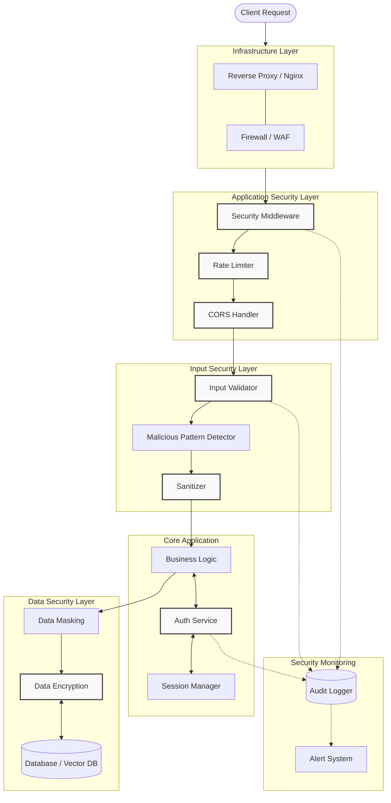

# Security Policy

## Supported Versions

| Version | Supported |
|---------|-----------|
| 2.1.x   | Yes (Hardened) |
| 2.0.x   | Limited   |
| 1.x.x   | No        |

## Security Features (v2.1 Hardened)

### Defense in Depth

This application implements multiple layers of security:

1. **Network Layer**: Rate limiting, IP blocking, request validation
2. **Application Layer**: Input sanitization, CSRF protection, security headers
3. **Authentication Layer**: Brute force protection, secure password hashing, session management
4. **Data Layer**: Input validation, output encoding, SQL injection prevention

### Authentication & Authorization

- **PBKDF2-SHA256** password hashing with 310,000 iterations (OWASP recommended)
- **Secure session tokens** using cryptographically secure random generation
- **API key authentication** for service-to-service communication
- **Brute force protection** with automatic account lockout
- **Rate limiting** per user/IP with token bucket algorithm

### Media Ingestion Security

- **URL Validation**: Whitelist safe protocols (http, https), block file:// and other dangerous protocols
- **Video Source Verification**: Validate YouTube URLs, domain verification for external URLs
- **File Upload Security**: Type validation, size limits (max 500MB), malware scanning support
- **Transcript Processing**: Sanitize extracted text, detect and flag suspicious content
- **Rate Limiting**: Separate limits for media uploads (5 per hour per user) to prevent abuse
- **Third-party API Security**: Secure API key storage, request validation, response sanitization

### Attack Prevention

| Attack Type | Protection |
|-------------|------------|
| SQL Injection | Input validation, parameterized queries |
| XSS (Cross-Site Scripting) | HTML encoding, Content Security Policy |
| CSRF (Cross-Site Request Forgery) | Token-based protection |
| DDoS/DoS | Rate limiting, request size limits |
| Brute Force | Account lockout, progressive delays |
| Path Traversal | Path sanitization, input validation |
| Command Injection | Input validation, pattern blocking |
| Request Smuggling | Header validation, proxy configuration |
| Clickjacking | X-Frame-Options: DENY |
| MIME Sniffing | X-Content-Type-Options: nosniff |
| Malicious File Upload | File type validation, size limits, content scanning |
| Malicious URL | URL whitelist, domain verification, protocol blocking |
| External API Abuse | API key rotation, request signing, response validation |

### Security Headers

All responses include:
- `X-Frame-Options: DENY`
- `X-Content-Type-Options: nosniff`
- `X-XSS-Protection: 1; mode=block`
- `Referrer-Policy: strict-origin-when-cross-origin`
- `Permissions-Policy: geolocation=(), microphone=(), camera=()`
- `Content-Security-Policy` (for HTML responses)
- `Strict-Transport-Security` (production only)

### Security Monitoring

- **Audit logging** for all security-relevant events
- **Suspicious activity detection** with automatic alerts
- **Rate limit violation tracking** for threat identification
- **IP reputation management** with dynamic blocking

## Configuration

### Required Environment Variables for Production

| Variable | Description | Example |
|----------|-------------|---------|
| `JWT_SECRET_KEY` | Secret for JWT signing (64+ chars) | `$(python -c "import secrets; print(secrets.token_urlsafe(64))")` |
| `ADMIN_PASSWORD` | Admin account password | Strong password |
| `CORS_ORIGINS` | Allowed CORS origins | `https://yourdomain.com` |
| `DEBUG` | Must be `false` in production | `false` |

### Recommended Environment Variables

| Variable | Default | Description |
|----------|---------|-------------|
| `RATE_LIMIT_RPM` | 30 | Requests per minute per client |
| `RATE_LIMIT_RPH` | 500 | Requests per hour per client |
| `MAX_LOGIN_ATTEMPTS` | 5 | Failed logins before lockout |
| `LOCKOUT_DURATION_MINUTES` | 15 | Account lockout duration |
| `ACCESS_TOKEN_EXPIRE_MINUTES` | 30 | Session token lifetime |
| `TRUSTED_PROXIES` | 127.0.0.1 | IPs trusted for X-Forwarded-For |
| `IP_BLACKLIST` | (empty) | Comma-separated blocked IPs |
| `ENABLE_API_KEYS` | false | Whether to expose API keys |
| `MAX_UPLOAD_SIZE_MB` | 500 | Maximum file upload size in MB |
| `MEDIA_UPLOAD_LIMIT_HOUR` | 5 | Media uploads allowed per hour per user |
| `ALLOWED_VIDEO_FORMATS` | mp4,webm,avi | Allowed video file formats |
| `YOUTUBE_API_KEY` | (empty) | YouTube API key for transcript extraction |
| `ENABLE_EXTERNAL_URL_FETCH` | false | Allow URL content fetching |

## Secure Deployment Checklist

### Before Deployment

- [ ] Set strong `JWT_SECRET_KEY` (64+ characters)
- [ ] Set strong `ADMIN_PASSWORD`
- [ ] Set `DEBUG=false`
- [ ] Configure `CORS_ORIGINS` with your domains only
- [ ] Set `TRUSTED_PROXIES` to your reverse proxy IP
- [ ] Review and configure rate limits for your use case

### Infrastructure

- [ ] Use HTTPS with valid TLS 1.3 certificates
- [ ] Deploy behind reverse proxy (nginx, traefik, cloudflare)
- [ ] Configure firewall to restrict access
- [ ] Use container orchestration (Docker, Kubernetes)
- [ ] Run as non-root user in containers
- [ ] Enable access logging
- [ ] Set up monitoring and alerting
- [ ] Configure media upload folder with restricted permissions
- [ ] Set up file scanning for uploads (ClamAV or similar)
- [ ] Validate and secure third-party API keys
- [ ] Test media feature with malicious URLs and files

### Ongoing Security

- [ ] Regular dependency updates (`pip-audit`)
- [ ] Monitor `/api/security/suspicious` endpoint
- [ ] Review audit logs periodically
- [ ] Rotate secrets quarterly
- [ ] Security scanning in CI/CD pipeline

## Data Privacy & Media Content

### Privacy Considerations

- **User Upload Privacy**: Media files stored with user ID isolation
- **Content Extraction**: Transcripts and metadata extracted from media are sanitized
- **Third-party Services**: YouTube API calls log minimal data, no tracking cookies
- **Data Retention**: Configure automatic cleanup of old media files
- **GDPR Compliance**: User can request deletion of media history

### Media Source Validation

- YouTube: Validated through official YouTube API
- External URLs: Domain reputation checking, SSL certificate validation
- Local Files: File signature validation, MIME type verification
- Transcripts: PII detection and masking on extracted text

### Third-Party API Security

- All external API calls use HTTPS with certificate pinning
- API keys stored securely (not in code or logs)
- Request signing for sensitive operations
- Response validation to prevent injection attacks
- Automatic API key rotation recommended quarterly

### Media Feature Security Monitoring

- **Upload Tracking**: Monitor `/api/upload/video` and `/api/upload/url` endpoints
- **Rate Limit Alerts**: Alert when user hits media upload limits (5/hour)
- **File Scanning**: Implement real-time malware scanning for uploaded files
- **URL Reputation**: Check uploaded URLs against threat intelligence feeds
- **Transcript Validation**: Detect PII, malicious links in extracted transcripts
- **Suspicious Patterns**: Flag unusual patterns (bulk uploads, rapid changes)
- **API Usage Monitoring**: Track YouTube/external API call patterns for abuse

## API Security Endpoints

### GET /api/security/audit
Returns security audit log (admin only in production).

```bash
curl -H "Authorization: Bearer <token>" https://yourapi.com/api/security/audit
```

### GET /api/security/suspicious
Returns suspicious activity report (admin only in production).

```bash
curl -H "Authorization: Bearer <token>" https://yourapi.com/api/security/suspicious?hours=24
```

### Media Upload Security Endpoints

#### POST /api/upload/url
Securely process URLs and YouTube links for ingestion.

```bash
curl -X POST -H "Authorization: Bearer <token>" \
  -H "Content-Type: application/json" \
  -d '{"url": "https://youtube.com/watch?v=..."}' \
  https://yourapi.com/api/upload/url
```

**Security Controls:**
- URL validation and protocol filtering (http/https only)
- Rate limit: 5 uploads per hour per user
- Automatic timeout for slow/unreachable URLs
- Response sanitization

#### POST /api/upload/video
Securely upload video files for processing.

```bash
curl -X POST -H "Authorization: Bearer <token>" \
  -F "video=@video.mp4" \
  https://yourapi.com/api/upload/video
```

**Security Controls:**
- File type validation (mp4, webm, avi)
- Size limit: 500MB max
- Virus scanning integration available
- Rate limit: 5 uploads per hour per user

## Reporting a Vulnerability

### Process

1. **Do NOT** disclose the vulnerability publicly
2. Email details to the security contact
3. Include steps to reproduce
4. Allow 48 hours for initial response

### What to Include

- Description of the vulnerability
- Steps to reproduce
- Potential impact assessment
- Suggested fix (if available)

### Response Timeline

| Stage | Timeframe |
|-------|-----------|
| Initial Response | 48 hours |
| Severity Assessment | 5 days |
| Fix Development | 14-30 days |
| Public Disclosure | After fix is deployed |

### Recognition

- Security researchers will be credited (if desired)
- Critical vulnerabilities may qualify for recognition
- Security advisory will be published after fix

## Media Content Security Best Practices

### For Production Deployment

**File Storage Security:**
- Store media files outside web root directory
- Use dedicated storage with restricted permissions (0700)
- Implement encryption at rest for sensitive media
- Separate storage for temporary/processing vs. permanent storage

**Content Validation:**
- Implement ClamAV or similar for antivirus scanning
- Validate all extracted metadata before storage
- Sanitize all user-provided filenames
- Log all media access for audit trails

**External Service Integration:**
- Use dedicated API keys for each environment (dev/staging/prod)
- Store API keys in secrets management (HashiCorp Vault, AWS Secrets Manager)
- Implement request signing for API calls
- Monitor API quota usage to detect abuse

**Network Security:**
- Rate limit media endpoints separately from other API endpoints
- Use separate infrastructure for media processing (isolated containers/VMs)
- Implement IP whitelisting for third-party API callbacks
- Use VPN/private networks for communication with media services

**Monitoring & Alerting:**
```
Alerts to configure:
- Upload size exceeds 450MB (90% of limit)
- User exceeds 4 uploads/hour (80% of 5/hour limit)
- Failed file type validation attempts
- Invalid URL protocol attempts
- API rate limit warnings from YouTube/external services
- Processing timeout for video files
```

## Security Architecture



## Known Limitations

### Current Limitations

1. **In-Memory Storage**: Journal entries and sessions are stored in memory by default. Configure a persistent database for production.

2. **Single Instance**: Rate limiting is per-instance. Use Redis for distributed rate limiting in multi-instance deployments.

3. **LLM Security**: Ollama runs locally but prompt injection attacks should be considered for user-generated content.

### Recommended Mitigations

- Use PostgreSQL or similar for persistent storage
- Deploy Redis for distributed session/rate limit storage
- Implement additional prompt sanitization for LLM inputs
- Establish media content scanning pipeline (ClamAV for files, URL checker for links)
- Monitor media upload patterns for anomalies
- Regular security audits and penetration testing
- Quarterly security review of third-party API integrations

## Compliance Notes

This application implements security controls aligned with:
- **OWASP Top 10** (2021)
- **OWASP API Security Top 10** (2023)
- **CIS Controls** (v8)

For specific compliance requirements (GDPR, HIPAA, SOC2, PCI-DSS), additional configurations and controls may be required. Consult with a compliance specialist.

## Updates

This security policy is reviewed and updated with each release.

**Last Updated**: February 2026 (v2.2 Media Security Release)
