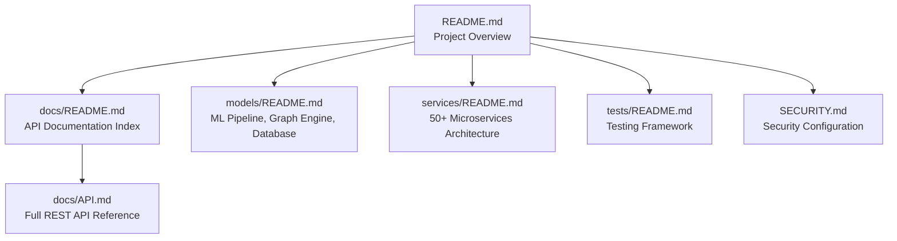
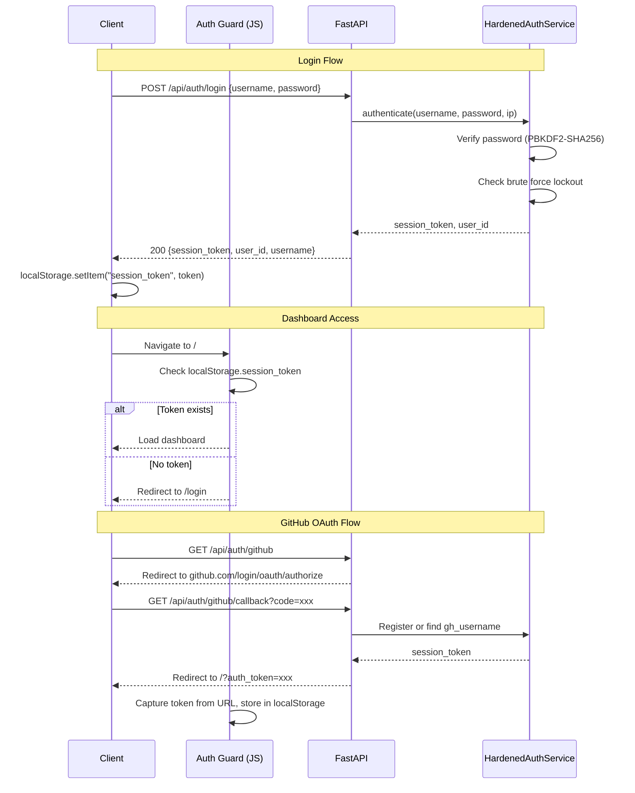

# Documentation

This folder contains comprehensive documentation for the StepWise AI system.

## Documentation Map



## Contents

### API Documentation

**[API.md](API.md)** -- Complete REST API reference including:

- Authentication endpoints (register, login, logout, GitHub OAuth)
- Decision analysis and AI chat
- Resume upload and parsing
- Journal and history management
- Analytics and simulation
- Data export and import (JSON, PDF, Text)
- Emotion detection endpoints
- WebSocket real-time updates
- Rate limiting information
- Error response formats

## Authentication Flow



## Quick Start

### Base URL

All API endpoints are available at:

```
http://localhost:8000
```

### Authentication

Most endpoints require a session token:

```bash
# Login
curl -X POST http://localhost:8000/api/auth/login \
  -H "Content-Type: application/json" \
  -d '{"username": "myuser", "password": "MyPassword123!"}'

# Response: {"session_token": "xxx", "user_id": "user_abc", "username": "myuser"}
```

Use the returned `session_token` in subsequent requests:

```bash
curl http://localhost:8000/api/analytics/user_abc \
  -H "Authorization: Bearer <session_token>"
```

### Common Operations

Analyze a Decision:
```bash
curl -X POST http://localhost:8000/api/analyze \
  -H "Content-Type: application/json" \
  -d '{"decision_type": "job_change", "description": "Should I accept this offer?"}'
```

AI Chat:
```bash
curl -X POST http://localhost:8000/api/chat \
  -H "Content-Type: application/json" \
  -d '{"message": "I am considering switching careers", "user_id": "user_abc"}'
```

Export Data:
```bash
curl http://localhost:8000/api/export/user_abc/json \
  -H "Authorization: Bearer <session_token>" \
  -o export.json
```

## Additional Resources

- **[Main README](../README.md)** -- Project overview, architecture, and setup
- **[Services README](../services/README.md)** -- Microservices architecture and API patterns
- **[Models README](../models/README.md)** -- ML pipeline and database documentation
- **[Tests README](../tests/README.md)** -- Testing framework and guides
- **[SECURITY.md](../SECURITY.md)** -- Security features and configuration

## API Versioning

The current API version is v3.0.0.

All endpoints are backward compatible. Breaking changes are documented in release notes.
