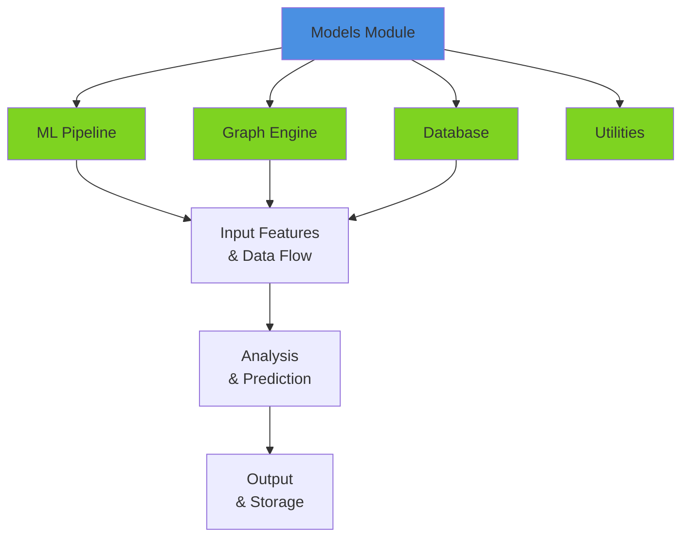
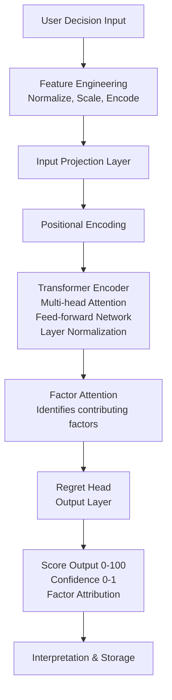

# Models Module

The models module contains the core machine learning pipeline, decision graph engine, and database schema for the Career Decision Regret System. This module is responsible for regret prediction, decision analysis, and data persistence.

## Table of Contents

[Overview](#overview)
[Architecture](#architecture)
[Components](#components)
[File Structure](#file-structure)
[Usage](#usage)
[Data Models](#data-models)

## Overview

The models module provides three main components:

1. ML Pipeline (ml_pipeline.py) - Advanced regret prediction using transformer-based neural networks
2. Graph Engine (graph_engine.py) - Decision graph analysis and network modeling
3. Database (database.py) - ORM models for data persistence using SQLAlchemy

## Architecture



## Components

### 1. ML Pipeline (ml_pipeline.py)

Advanced machine learning pipeline for regret prediction with transformer-based architecture.

#### Key Classes

TransformerRegretModel
- Purpose: Deep learning model for regret prediction
- Architecture: Transformer encoder with multi-head attention
- Input: Feature vectors (decision context, user profile, market conditions)
- Output: Regret score prediction (0-100), confidence level
- Key Modules:
  - PositionalEncoding: Temporal position encoding for sequence data
  - TransformerEncoderLayer: Multi-head attention encoder
  - Regret Head: Output prediction layer
  - Factor Attention: Identify key contributing factors

EnhancedRegretPredictor
- Purpose: High-level interface for regret prediction
- Responsibilities:
  - Feature preprocessing and normalization
  - Model inference
  - Result interpretation
  - Confidence scoring
- Methods:
  - predict_regret(features) - Generate regret prediction
  - predict_batch(feature_list) - Batch prediction
  - get_feature_importance() - Identify key factors
  - explain_prediction(features) - Provide explanation

Feature Processing
- StandardScaler: Normalize continuous features
- GradientBoostingRegressor: Ensemble method for hybrid predictions
- Feature extraction from:
  - Decision context (type, alternatives, risk level)
  - User profile (experience, age, risk tolerance)
  - Market conditions (industry health, skill demand)
  - Historical data (past decisions, outcomes)

#### Data Flow in ML Pipeline



### 2. Graph Engine (graph_engine.py)

Decision graph analysis engine for modeling relationships between decisions, outcomes, and factors.

#### Key Classes

EnhancedGraphNode
- Represents nodes in the decision network
- Node types: decision, outcome, milestone, factor, expert_insight
- Attributes:
  - id: Unique identifier
  - node_type: Category of node
  - label: Display name
  - weight: Importance score (0-1)
  - embedding: Vector representation
  - visit_count: Frequency of consideration
  - success_rate: Historical success metric
  - attributes: Custom metadata

EnhancedGraphEdge
- Represents relationships between nodes
- Edge types: influences, causes_regret, improves, mitigates, related_to
- Attributes:
  - source, target: Connected nodes
  - edge_type: Relationship type
  - weight: Relationship strength (0-1)
  - confidence: Edge reliability (0-1)
  - sample_count: Data supporting this edge

AdvancedDecisionGraph
- Full graph management and analysis
- Responsibilities:
  - Maintain decision network (NetworkX backend)
  - Compute node importance and centrality
  - Identify critical paths
  - Detect decision clusters and patterns
  - Track graph evolution over time

MarketConditions
- Current market state representation
- Industry health scores by sector
- Skill demand mapping
- Remote work impact factor
- Job market index

#### Decision Graph Model

```
Decisions Layer
    │
    ├─ Job Change Decision
    │   ├─ Influences: Technical Growth
    │   ├─ Influences: Work-Life Balance
    │   ├─ Relates To: Previous Job Switch
    │   ├─ Mitigates: Career Stagnation Risk
    │   └─ Edges: Salary, Location, Culture Factors
    │
    ├─ Career Switch Decision
    │   ├─ Influences: Industry Change
    │   ├─ Improves: Skill Relevance
    │   ├─ Causes Regret: Sunk Cost Fallacy
    │   └─ Edges: Retraining, Network, Experience
    │
    └─ Education Decision
        ├─ Influences: Career Prospects
        ├─ Improves: Market Position
        ├─ Causes Regret: Opportunity Cost
        └─ Edges: Tuition, Time, Eligibility

Outcome Layer
    │
    ├─ Positive Outcomes
    │   ├─ Career Growth
    │   ├─ High Satisfaction
    │   ├─ Financial Success
    │   └─ Work-Life Balance
    │
    └─ Negative Outcomes
        ├─ Career Stagnation
        ├─ Low Satisfaction
        ├─ Financial Loss
        └─ Burnout

Factor Layer
    │
    ├─ Positive Factors
    │   ├─ Technical Skills
    │   ├─ Market Demand
    │   ├─ Company Culture
    │   └─ Work-Life Balance
    │
    └─ Negative Factors
        ├─ Sunk Cost Fallacy
        ├─ Risk Aversion
        ├─ Market Downturn
        └─ Personal Obligations
```

### 3. Database (database.py)

SQLAlchemy ORM models for data persistence and relationship management.

#### Database Schema

User Table
- id: Primary key
- username: Unique identifier
- email: Contact information
- hashed_password: Secure authentication
- created_at: Registration timestamp
- is_active: Account status
- preferences: JSON metadata

CareerDecision Table
- id: Primary key
- user_id: Foreign key to User
- decision_type: Category (job_change, career_switch, education, etc.)
- description: Decision details
- alternatives: JSON list of options
- context_data: JSON contextual information
- created_at: Decision timestamp
- status: Current state (pending, completed, regretted, etc.)

RegretAnalysis Table
- id: Primary key
- user_id: Foreign key to User
- decision_id: Foreign key to CareerDecision
- predicted_regret: Regret score (0-100)
- confidence: Prediction confidence (0-1)
- risk_level: Risk assessment (low, medium, high, critical)
- top_factors: JSON array of contributing factors
- recommendations: JSON array of suggestions
- graph_analysis: JSON graph metrics
- llm_response: LLM-generated explanation

Feedback Table
- id: Primary key
- user_id: Foreign key
- analysis_id: Foreign key
- feedback_type: Type of feedback
- content: User feedback details
- helpful_score: User rating
- created_at: Timestamp

JournalEntry Table
- id: Primary key
- user_id: Foreign key
- decision_id: Foreign key
- title: Entry title
- content: Journal content
- emotions: JSON emotion tags
- created_at: Entry timestamp

#### Entity Relationship Diagram

```
User
├── 1 --- n --- CareerDecision
│                    └── 1 --- n --- RegretAnalysis
│                    └── 1 --- n --- JournalEntry
├── 1 --- n --- Feedback
│                    └── analysis_id -> RegretAnalysis
└── 1 --- n --- JournalEntry
```

## File Structure

```
models/
├── __init__.py                 Module initialization and exports
├── README.md                   This file
├── ml_pipeline.py             Machine learning pipeline and models
│   ├── PositionalEncoding
│   ├── TransformerRegretModel
│   ├── EnhancedRegretPredictor
│   └── Feature processing utilities
├── graph_engine.py            Decision graph and network analysis
│   ├── EnhancedGraphNode
│   ├── EnhancedGraphEdge
│   ├── MarketConditions
│   └── AdvancedDecisionGraph
└── database.py                Database models and schema
    ├── Base (SQLAlchemy declarative base)
    ├── User
    ├── CareerDecision
    ├── RegretAnalysis
    ├── Feedback
    └── JournalEntry
```

## Usage

### Using the ML Pipeline

```python
from models.ml_pipeline import EnhancedRegretPredictor

# Initialize predictor
predictor = EnhancedRegretPredictor(model_path="model_checkpoint.pt")

# Prepare features
features = {
    'decision_type': 'job_change',
    'current_salary': 100000,
    'offered_salary': 120000,
    'years_experience': 5,
    'risk_tolerance': 0.6,
    'market_health': 0.8
}

# Make prediction
regret_score, confidence, factors = predictor.predict_regret(features)
print(f"Predicted regret: {regret_score:.1f}/100 (confidence: {confidence:.2f})")
print(f"Key factors: {factors}")

# Batch processing
batch_features = [features for _ in range(10)]
predictions = predictor.predict_batch(batch_features)

# Get factor importance
importance = predictor.get_feature_importance()
```

### Using the Decision Graph

```python
from models.graph_engine import AdvancedDecisionGraph, EnhancedGraphNode, EnhancedGraphEdge

# Initialize graph
graph = AdvancedDecisionGraph()

# Add nodes
decision_node = EnhancedGraphNode(
    id="jc_001",
    node_type="decision",
    label="Job Change Decision",
    weight=1.0
)
graph.add_node(decision_node)

# Add edges
edge = EnhancedGraphEdge(
    source="jc_001",
    target="salary_factor",
    edge_type="influences",
    weight=0.8,
    confidence=0.9
)
graph.add_edge(edge)

# Analyze graph
centrality = graph.compute_centrality()
critical_nodes = graph.identify_critical_nodes()
patterns = graph.detect_patterns()
```

### Working with Database

```python
from models.database import User, CareerDecision, RegretAnalysis
from sqlalchemy import create_engine
from sqlalchemy.orm import sessionmaker

# Create database engine
engine = create_engine("sqlite:///career_system.db")

# Create session
Session = sessionmaker(bind=engine)
session = Session()

# Create user
user = User(
    username="john_doe",
    email="john@example.com",
    hashed_password="hashed_pwd..."
)
session.add(user)
session.commit()

# Create decision
decision = CareerDecision(
    user_id=user.id,
    decision_type="job_change",
    description="Considering new role at Tech Corp"
)
session.add(decision)
session.commit()

# Create analysis
analysis = RegretAnalysis(
    user_id=user.id,
    decision_id=decision.id,
    predicted_regret=35.0,
    confidence=0.85,
    risk_level="medium"
)
session.add(analysis)
session.commit()
```

## Data Models

### Decision Context

```
DecisionContext = {
    "type": str,                      # job_change, career_switch, education
    "description": str,               # Detailed description
    "alternatives": List[str],        # Alternative options
    "timeline": str,                  # Decision timeframe
    "constraints": List[str],         # Limiting factors
    "goals": List[str],              # Desired outcomes
    "riskLevel": float,              # 0-1 risk assessment
    "confidence": float              # 0-1 user confidence
}
```

### User Profile

```
UserProfile = {
    "age": int,
    "yearsExperience": int,
    "currentRole": str,
    "industry": str,
    "skills": List[str],
    "education": str,
    "riskTolerance": float,          # 0-1
    "locations": List[str],
    "salaryExpectation": int,
    "careerGoals": List[str],
    "personalValues": List[str]
}
```

### Prediction Output

```
PredictionOutput = {
    "regretScore": float,            # 0-100
    "confidence": float,             # 0-1
    "riskLevel": str,               # low, medium, high, critical
    "topFactors": List[str],        # Contributing factors
    "recommendations": List[str],    # Actionable recommendations
    "alternatives": List[str],       # Better options
    "timeline": str                 # Decision urgency
}
```

## Performance Considerations

### ML Pipeline Performance
- Model Inference: ~100-200ms per prediction
- Batch Processing: ~50ms per item for batch of 100
- Feature Engineering: ~10-20ms per sample
- GPU Acceleration: Available for transformer inference

### Graph Analysis Performance
- Node Addition: O(1) average case
- Edge Query: O(n) for specific node's edges
- Centrality Computation: O(n^2) - compute periodically
- Pattern Detection: O(n^3) worst case, cached for performance

### Database Performance
- User Lookup: O(1) with index on username
- Decision Query: O(log n) with B-tree indexes
- Analysis Join: Efficient with indexes on foreign keys
- Batch Inserts: Recommended for large data loads

## Dependencies

Core Dependencies:
- numpy: Numerical computation
- torch: Deep learning framework
- scikit-learn: Machine learning utilities
- sqlalchemy: ORM and database toolkit
- networkx: Graph analysis

Optional Dependencies:
- pytorch-lightning: Advanced training utilities
- tensorboard: Visualization
- pgvector: Vector similarity search

## Configuration

Key Parameters (configurable in config.py):

```python
# ML Model
MODEL_PATH = "models/checkpoint.pt"
TRANSFORMER_LAYERS = 4
ATTENTION_HEADS = 8
MODEL_DIM = 256
DROPOUT = 0.1

# Graph
DECAY_FACTOR = 0.95
MAX_NODES = 10000
RETENTION_DAYS = 365

# Database
DB_URL = "sqlite:///career_system.db"
POOL_SIZE = 10
ECHO_SQL = False
```

## Testing

Run model tests:

```bash
pytest tests/test_ml_pipeline.py -v
pytest tests/test_graph_engine.py -v
pytest tests/test_database.py -v
```

## Troubleshooting

### Model Inference Issues
- Check model checkpoint exists at MODEL_PATH
- Verify feature dimensions match model input
- Ensure CUDA/GPU availability for large batches
- Check for missing or invalid features

### Graph Operations Issues
- Verify node IDs are unique when adding
- Ensure edge source/target nodes exist
- Check for circular dependencies
- Monitor memory usage for large graphs

### Database Issues
- Verify database file permissions
- Check connection string format
- Ensure migrations are applied
- Monitor connection pool exhaustion

## Best Practices

1. Feature Normalization: Always normalize features before prediction
2. Batch Processing: Use batch prediction for multiple samples (more efficient)
3. Graph Maintenance: Periodically prune old nodes to manage memory
4. Error Handling: Always wrap model calls in try-except blocks
5. Caching: Cache expensive computations (centrality, patterns)
6. Versioning: Track model versions for reproducibility

## Future Roadmap

- Add ONNX export for model inference
- Implement incremental learning for online updates
- Add explainability methods (SHAP, LIME)
- Distributed graph processing with Dask
- Time-series analysis capabilities
- Multi-objective regret optimization
