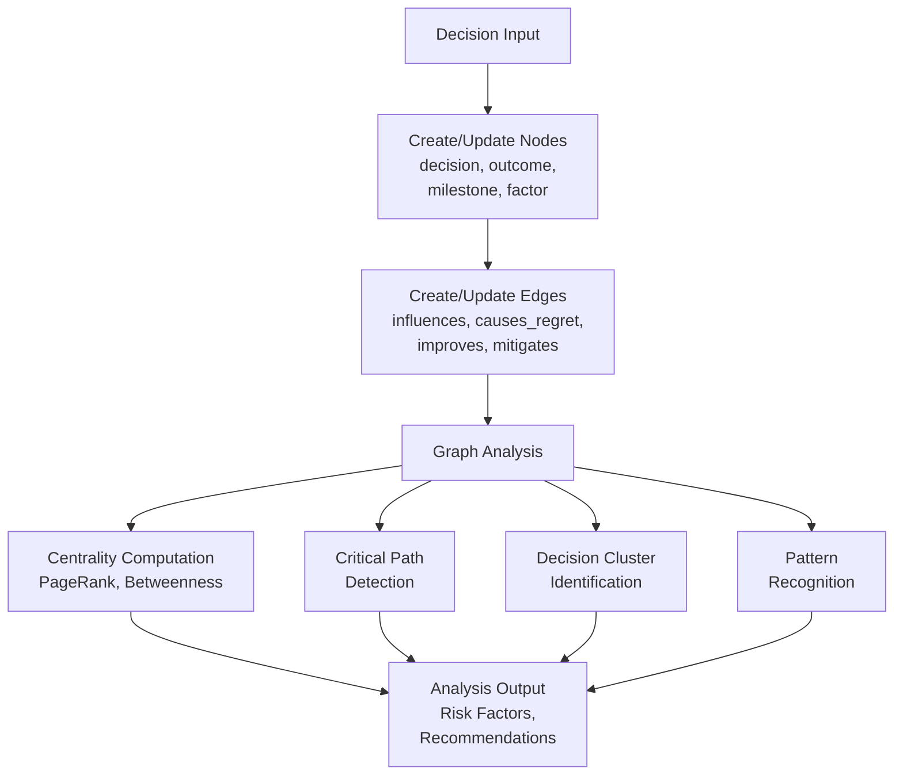
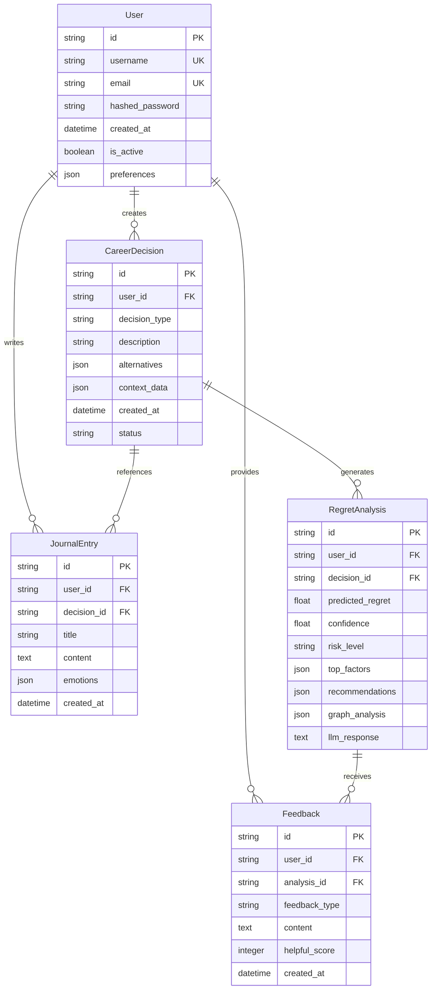

# Models Module

The models module contains the core machine learning pipeline, decision graph engine, and database schema for the StepWise AI System. This module is responsible for regret prediction, decision analysis, and data persistence.

## Table of Contents

- [Overview](#overview)
- [Architecture](#architecture)
- [Components](#components)
- [Data Flow](#data-flow)
- [Database Schema](#database-schema)
- [Usage](#usage)
- [Performance](#performance)
- [Configuration](#configuration)

## Overview

The models module provides three main components:

1. **ML Pipeline** (ml_pipeline.py) -- Transformer-based neural network for regret prediction with gradient boosting ensemble
2. **Graph Engine** (graph_engine.py) -- Decision graph analysis and network modeling using NetworkX
3. **Database** (database.py) -- ORM models for data persistence using SQLAlchemy

## Architecture


```mermaid
graph TD
    subgraph Models["Models Module"]
        ML["ML Pipeline<br/>ml_pipeline.py"]
        GE["Graph Engine<br/>graph_engine.py"]
        DB["Database<br/>database.py"]
    end

    subgraph MLDetail["ML Pipeline Components"]
        PE["PositionalEncoding"]
        TRM["TransformerRegretModel<br/>Multi-Head Attention"]
        ERP["EnhancedRegretPredictor<br/>High-Level Interface"]
        GB["GradientBoostingRegressor<br/>Ensemble Member"]
        SS["StandardScaler<br/>Feature Normalization"]
    end

    subgraph GEDetail["Graph Engine Components"]
        GN["EnhancedGraphNode<br/>decision, outcome, factor"]
        GEd["EnhancedGraphEdge<br/>influences, causes_regret"]
        ADG["AdvancedDecisionGraph<br/>NetworkX Backend"]
        MC["MarketConditions<br/>Industry, Skills, Demand"]
    end

    subgraph DBDetail["Database Models"]
        USR["User"]
        CD["CareerDecision"]
        RA["RegretAnalysis"]
        FB["Feedback"]
        JE["JournalEntry"]
    end

    ML --> PE
    ML --> TRM
    ML --> ERP
    ML --> GB
    ML --> SS

    GE --> GN
    GE --> GEd
    GE --> ADG
    GE --> MC

    DB --> USR
    DB --> CD
    DB --> RA
    DB --> FB
    DB --> JE
```

## Data Flow

### ML Pipeline Data Flow


```mermaid
graph LR
    A["User Decision Input<br/>type, description,<br/>risk_tolerance"]
    B["Feature Engineering<br/>Normalize, Scale,<br/>Encode Categoricals"]
    C["Input Projection<br/>Linear Layer"]
    D["Positional Encoding<br/>Temporal Sequence"]
    E["Transformer Encoder<br/>4 Layers, 8 Heads<br/>Feed-Forward + LayerNorm"]
    F["Factor Attention<br/>Identifies Key<br/>Contributing Factors"]
    G["Regret Head<br/>Output Projection"]
    H["Ensemble Combiner<br/>Transformer 70%<br/>GradientBoosting 30%"]
    I["Final Output<br/>Score 0-100<br/>Confidence 0-1<br/>Factor Attribution"]

    A --> B
    B --> C
    C --> D
    D --> E
    E --> F
    F --> G
    G --> H
    H --> I
```

### Decision Graph Data Flow


```mermaid
graph TD
    INPUT["Decision Input"] --> NODES["Create/Update Nodes<br/>decision, outcome,<br/>milestone, factor"]
    NODES --> EDGES["Create/Update Edges<br/>influences, causes_regret,<br/>improves, mitigates"]
    EDGES --> ANALYSIS["Graph Analysis"]

    ANALYSIS --> CENT["Centrality Computation<br/>PageRank, Betweenness"]
    ANALYSIS --> PATH["Critical Path<br/>Detection"]
    ANALYSIS --> CLUSTER["Decision Cluster<br/>Identification"]
    ANALYSIS --> PATTERN["Pattern<br/>Recognition"]

    CENT --> OUTPUT["Analysis Output<br/>Risk Factors,<br/>Recommendations"]
    PATH --> OUTPUT
    CLUSTER --> OUTPUT
    PATTERN --> OUTPUT
```

## Components

### ML Pipeline (ml_pipeline.py)

**TransformerRegretModel**
- Architecture: Transformer encoder with multi-head self-attention
- Input: Feature vectors (decision context, user profile, market conditions)
- Output: Regret score (0-100) with confidence level
- Key modules: PositionalEncoding, TransformerEncoderLayer, Regret Head, Factor Attention

**EnhancedRegretPredictor**
- High-level interface for regret prediction
- Feature preprocessing and normalization
- Ensemble combination (Transformer 70% + GradientBoosting 30%)
- Methods: `predict_regret(features)`, `predict_batch(feature_list)`, `get_feature_importance()`, `explain_prediction(features)`

**Feature Processing**
- StandardScaler for continuous features
- GradientBoostingRegressor for ensemble predictions
- Feature extraction from: decision context, user profile, market conditions, historical data

### Graph Engine (graph_engine.py)

**EnhancedGraphNode**
- Node types: decision, outcome, milestone, factor, expert_insight
- Attributes: id, label, weight (0-1), embedding, visit_count, success_rate

**EnhancedGraphEdge**
- Edge types: influences, causes_regret, improves, mitigates, related_to
- Attributes: source, target, weight (0-1), confidence (0-1), sample_count

**AdvancedDecisionGraph**
- Full graph management using NetworkX backend
- Centrality computation (PageRank, betweenness)
- Critical path identification
- Cluster detection and pattern analysis

**MarketConditions**
- Industry health scores by sector
- Skill demand mapping
- Remote work impact factor
- Job market index

## Database Schema


```mermaid
erDiagram
    User ||--o{ CareerDecision : creates
    User ||--o{ Feedback : provides
    User ||--o{ JournalEntry : writes
    CareerDecision ||--o{ RegretAnalysis : generates
    CareerDecision ||--o{ JournalEntry : references
    RegretAnalysis ||--o{ Feedback : receives

    User {
        string id PK
        string username UK
        string email UK
        string hashed_password
        datetime created_at
        boolean is_active
        json preferences
    }

    CareerDecision {
        string id PK
        string user_id FK
        string decision_type
        string description
        json alternatives
        json context_data
        datetime created_at
        string status
    }

    RegretAnalysis {
        string id PK
        string user_id FK
        string decision_id FK
        float predicted_regret
        float confidence
        string risk_level
        json top_factors
        json recommendations
        json graph_analysis
        text llm_response
    }

    Feedback {
        string id PK
        string user_id FK
        string analysis_id FK
        string feedback_type
        text content
        integer helpful_score
        datetime created_at
    }

    JournalEntry {
        string id PK
        string user_id FK
        string decision_id FK
        string title
        text content
        json emotions
        datetime created_at
    }
```

## Usage

### Using the ML Pipeline

```python
from models.ml_pipeline import EnhancedRegretPredictor

predictor = EnhancedRegretPredictor(model_path="model_checkpoint.pt")

features = {
    'decision_type': 'job_change',
    'current_salary': 100000,
    'offered_salary': 120000,
    'years_experience': 5,
    'risk_tolerance': 0.6,
    'market_health': 0.8
}

regret_score, confidence, factors = predictor.predict_regret(features)
```

### Using the Decision Graph

```python
from models.graph_engine import AdvancedDecisionGraph, EnhancedGraphNode, EnhancedGraphEdge

graph = AdvancedDecisionGraph()

decision_node = EnhancedGraphNode(
    id="jc_001", node_type="decision",
    label="Job Change Decision", weight=1.0
)
graph.add_node(decision_node)

edge = EnhancedGraphEdge(
    source="jc_001", target="salary_factor",
    edge_type="influences", weight=0.8, confidence=0.9
)
graph.add_edge(edge)

centrality = graph.compute_centrality()
critical_nodes = graph.identify_critical_nodes()
```

## Performance

| Operation | Latency | Notes |
|-----------|---------|-------|
| Model Inference (single) | 100-200ms | Transformer forward pass |
| Batch Prediction (100 items) | ~50ms/item | Parallelized |
| Feature Engineering | 10-20ms | Per sample |
| Graph Node Addition | O(1) | Average case |
| Centrality Computation | O(n^2) | Cache results |
| Pattern Detection | O(n^3) | Worst case, cached |
| User Lookup (indexed) | O(1) | With username index |
| Decision Query | O(log n) | B-tree indexes |

## Configuration

Key parameters from `config.py`:

| Parameter | Default | Description |
|-----------|---------|-------------|
| MODEL_PATH | ./models | Model checkpoint directory |
| ML_LEARNING_RATE | 0.001 | Training learning rate |
| ENSEMBLE_DL_WEIGHT | 0.7 | Transformer weight in ensemble |
| ENSEMBLE_ML_WEIGHT | 0.3 | Gradient boosting weight in ensemble |
| DECAY_FACTOR | 0.95 | Graph decay factor |
| TEMPORAL_DECAY | 0.99 | Temporal decay for predictions |
| MONTE_CARLO_SIMULATIONS | 1000 | Simulation iterations |
| DATABASE_URL | sqlite+aiosqlite:///./career_regret.db | Database connection |

## Dependencies

Core dependencies:
- numpy -- Numerical computation
- torch -- Deep learning framework (PyTorch)
- scikit-learn -- Machine learning utilities
- sqlalchemy -- ORM and database toolkit
- networkx -- Graph analysis

## Testing

```bash
pytest tests/test_imports.py -v
pytest tests/test_phase2_services.py -v
```
