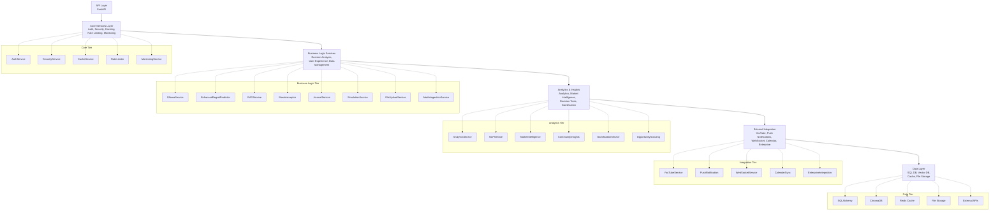

# Services Module

The services module contains 50+ microservices that provide specialized functionality for the Career Decision Regret System. Each service is designed to be modular, scalable, and independently deployable.

## Table of Contents

[Overview](#overview)
[Architecture](#architecture)
[Core Services](#core-services)
[AI and ML Services](#ai-and-ml-services)
[Analytics and Insights Services](#analytics-and-insights-services)
[User Experience Services](#user-experience-services)
[Data Management Services](#data-management-services)
[Integration Services](#integration-services)
[Utility and Support Services](#utility-and-support-services)
[Service Initialization](#service-initialization)
[Cross-Service Communication](#cross-service-communication)

## Overview

The services layer provides:
- Separation of concerns through microservices architecture
- Reusable, testable components
- Async support for high performance
- Event-driven communication patterns
- Graceful degradation and fallback mechanisms

## Architecture



## Core Services

### Authentication & Security

AuthService
- Purpose: User authentication and session management
- Methods:
  - authenticate_user(username, password) - Validate credentials
  - create_session(user_id) - Generate session token
  - validate_session(token) - Verify token validity
  - revoke_session(token) - Logout user
  - hash_password(password) - Secure password hashing

SecurityConfig
- Purpose: Security configuration and policy enforcement
- Responsibilities:
  - Rate limiting configuration
  - Request validation rules
  - CORS policy management
  - Input validation rules
  - Output sanitization

HardenedAuthService
- Purpose: Enhanced security with additional protections
- Features:
  - Multi-factor authentication support
  - IP whitelisting
  - Session timeout enforcement
  - Failed attempt tracking
  - Suspicious activity detection

AuditLogger
- Purpose: Security event logging and monitoring
- Logs:
  - Authentication events
  - Authorization failures
  - Data access
  - Configuration changes
  - System errors

### Caching & Rate Limiting

CacheService
- Purpose: In-memory caching for performance
- Features:
  - TTL-based cache expiration
  - LRU eviction policy
  - Thread-safe operations
  - Cache statistics
- Methods:
  - get(key) - Retrieve cached value
  - set(key, value, ttl) - Store cached value
  - delete(key) - Remove from cache
  - clear() - Flush all cache

RateLimiter
- Purpose: API request rate limiting
- Strategies:
  - Per-user rate limits
  - Global rate limits
  - Sliding window implementation
  - Backoff mechanisms
- Methods:
  - check_rate_limit(user_id) - Verify within limits
  - record_request(user_id) - Register request
  - get_remaining(user_id) - Get quota remaining

### Monitoring & Observability

MonitoringService
- Purpose: System health monitoring
- Tracks:
  - Request/response metrics
  - Error rates and types
  - Service availability
  - Resource utilization
  - Performance benchmarks
- Methods:
  - record(endpoint) - Log request
  - get_metrics() - Retrieve health metrics
  - get_service_status() - System status

## AI and ML Services

### Language Model Services

OllamaService
- Purpose: Local LLM inference engine
- Responsibilities:
  - Model loading and management
  - Inference requests
  - Prompt formatting
  - Response generation
- Configuration:
  - Base URL (http://localhost:11434)
  - Model selection (llama3.2, etc.)
  - Temperature setting
  - Max tokens

EnhancedOllamaService
- Purpose: Advanced LLM features with RAG integration
- Extensions:
  - Context injection from RAG
  - Multi-turn conversations
  - Response quality scoring
  - Fallback mechanisms
  - Error recovery

MultiLLMService
- Purpose: Multi-model LLM orchestration
- Features:
  - Model selection based on task
  - Load balancing
  - Fallback routing
  - Cost optimization
  - Response comparison

### Knowledge & Retrieval Services

RAGService
- Purpose: Retrieval-Augmented Generation for knowledge
- Components:
  - Vector embeddings using SentenceTransformers
  - ChromaDB for vector storage
  - Document retrieval
  - Context ranking
- Methods:
  - retrieve(query, top_k) - Search knowledge base
  - add_document(id, category, title, content) - Index new content
  - add_media_content(media_id, type, title, content) - Index media
  - get_context_for_decision(type, description) - Get decision context

KnowledgeService
- Purpose: Structured knowledge management
- Features:
  - Topic organization
  - Expert insights
  - Best practices database
  - Skill mapping
  - Career pathways

### Natural Language Processing

NLPService
- Purpose: Text analysis and understanding
- Capabilities:
  - Sentiment analysis
  - Intent classification
  - Entity recognition
  - Text summarization
  - Emotion detection from text
- Methods:
  - classify_intent(text) - Identify user intent
  - analyze_sentiment(text) - Emotion analysis
  - extract_entities(text) - Find key entities
  - summarize(text) - Generate summary

EmotionDetectionService
- Purpose: Advanced emotion and psychological state detection
- Detection:
  - Primary emotions (joy, fear, anger, etc.)
  - Emotional intensity levels
  - Psychological well-being indicators
  - Decision stress levels
  - Cognitive biases

### Decision Support Services

FeedbackLoop
- Purpose: Continuous learning from user feedback
- Methods:
  - add_feedback(type, content) - Record feedback
  - analyze_feedback() - Extract insights
  - improve_recommendations() - Adapt system
  - get_improvement_insights() - Summarize improvements

AdvancedFeedbackLoop
- Purpose: Enhanced feedback analysis and adaptation
- Features:
  - Comparative feedback analysis
  - Pattern detection
  - Quality scoring
  - Recommendation refinement
  - Long-term trend analysis

BiasInterceptorService
- Purpose: Detect and mitigate cognitive biases
- Biases Detected:
  - Sunk cost fallacy
  - Confirmation bias
  - Availability bias
  - Anchoring bias
  - Overconfidence
- Methods:
  - detect_biases(decision) - Identify biases
  - suggest_mitigation(bias) - Recommend counters
  - get_bias_score(decision) - Quantify bias impact

OpportunityScoutService
- Purpose: Proactive opportunity identification
- Features:
  - Market opportunity detection
  - Skill-opportunity matching
  - Hidden career paths
  - Timing optimization
  - Risk assessment

## Analytics and Insights Services

### Analytics Core

AnalyticsService
- Purpose: User behavior and decision tracking
- Tracking:
  - Decision frequency
  - User engagement metrics
  - Feature usage
  - Outcome tracking
  - Performance analytics
- Methods:
  - get_user_analytics(user_id) - User overview
  - get_trends(user_id) - Trend analysis
  - generate_report(user_id) - Comprehensive report

AdvancedAnalyticsService
- Purpose: Deep statistical and predictive analytics
- Analyses:
  - Regression analysis
  - Clustering
  - Time-series forecasting
  - Anomaly detection
  - Predictive modeling

### Market Intelligence

MarketIntelligenceService
- Purpose: Career market insights and trends
- Data Points:
  - Industry health scores
  - Salary trends by role/location
  - Job market demand
  - Skill trends
  - Career path popularity
- Methods:
  - get_salary_data(role, location) - Salary info
  - get_industry_trends(industry) - Market trends
  - get_demand_forecast(skill) - Demand prediction

CommunityInsightsService
- Purpose: Aggregated community career insights
- Features:
  - Decision outcome aggregation
  - Success rate calculations
  - Common regret patterns
  - Popular career transitions
  - Community trends

### Decision Analysis

OutcomeLearningService
- Purpose: Learn from decision outcomes over time
- Methods:
  - record_outcome(decision_id, outcome) - Log result
  - get_outcome_distribution(decision_type) - Analyze results
  - extract_patterns(outcomes) - Find patterns
  - update_regret_model() - Improve predictions

SimulationService
- Purpose: Simulation of decision outcomes
- Features:
  - Scenario modeling
  - Outcome simulation
  - Sensitivity analysis
  - What-if scenarios
  - Comparative analysis
- Methods:
  - simulate_career_path(decision) - Path simulation
  - compare_scenarios(scenarios) - Compare options
  - get_risk_adjusted_outcomes(scenarios) - Risk analysis

## User Experience Services

### Decision Support Tools

CoachingService
- Purpose: Personalized career coaching
- Capabilities:
  - Decision guidance
  - Interview preparation
  - Career planning
  - Skill development advice
  - Negotiation tactics
- Methods:
  - get_coaching_session(user_id) - Get guidance
  - provide_coaching_for(decision_type) - Specialized coaching
  - generate_action_plan(goals) - Create plan

FutureSelfService
- Purpose: Future self visualization and planning
- Features:
  - 5-year projection
  - Multiple timeline scenarios
  - Goal setting and tracking
  - Progress visualization
  - Life balance assessment

DecisionTemplateService
- Purpose: Structured decision-making templates
- Templates:
  - Job offer evaluation
  - Career switch assessment
  - Education decision matrix
  - Skill development planning
  - Work-life balance evaluation

RoadmapService
- Purpose: Career roadmap planning
- Features:
  - Multi-year planning
  - Milestone tracking
  - Skill building roadmaps
  - Network development planning
  - Learning path recommendations

### Personalization Services

JournalService
- Purpose: Personal career journal and reflection
- Features:
  - Decision journaling
  - Emotion tracking
  - Reflection prompts
  - Progress tracking
  - Outcome recording
- Methods:
  - create_entry(content) - New journal entry
  - get_entries(date_range) - Retrieve entries
  - analyze_entries() - Extract patterns

GamificationService
- Purpose: Engagement through gamification
- Features:
  - Achievement tracking
  - Point systems
  - Leaderboards
  - Challenges and quests
  - Progress visualization
- Methods:
  - add_achievement(user_id, achievement) - Award achievement
  - get_user_level(user_id) - Get user progress
  - get_leaderboard() - Competition ranking

### Voice and Communication

VoiceSpeechService
- Purpose: Voice input and output for accessibility
- Features:
  - Speech-to-text conversion
  - Text-to-speech synthesis
  - Voice command recognition
  - Audio feedback

VoiceJournalService
- Purpose: Voice-based journaling
- Features:
  - Record voice entries
  - Transcription
  - Emotion analysis from voice
  - Storage and retrieval

## Data Management Services

### Data I/O

FileUploadService
- Purpose: File upload and processing
- Supports:
  - Documents (PDF, DOCX)
  - Spreadsheets (XLSX, CSV)
  - Code files
  - Images
  - Videos
- Methods:
  - process_file(content, filename) - Process upload
  - get_user_files(user_id) - List user files
  - process_url_input(url) - Process URL
  - process_video_file_input(file) - Process video

MediaIngestionService
- Purpose: Video and media content processing
- Supports:
  - Local video files
  - YouTube videos
  - Web URLs
  - Audio extraction
  - Transcript generation
- Methods:
  - process_url(url) - Process URL
  - process_video_file(file) - Process video
  - get_user_media(user_id) - List media

ResumeParserService
- Purpose: Parse and extract resume information
- Extracts:
  - Contact information
  - Work experience
  - Education
  - Skills
  - Certifications
  - Achievements
- Methods:
  - parse_resume(content) - Extract data
  - extract_skills(resume) - Skill identification
  - match_jobs(resume, jobs) - Job matching

ExportService
- Purpose: Data export and report generation
- Formats:
  - PDF reports
  - CSV data dumps
  - JSON exports
  - HTML reports
- Methods:
  - generate_report(user_id) - Create report
  - export_data(user_id, format) - Export data
  - schedule_export(config) - Scheduled export

PersistenceService
- Purpose: Long-term data persistence
- Features:
  - Database operations
  - Transaction management
  - Backup mechanisms
  - Data integrity
  - Schema evolution

### Privacy and Security

DataPrivacyService
- Purpose: Privacy protection and compliance
- Features:
  - GDPR compliance
  - Data anonymization
  - Privacy controls
  - Consent management
  - Data retention policies
- Methods:
  - anonymize_user_data(user_id) - Anonymize data
  - export_user_data(user_id) - GDPR export
  - delete_user_data(user_id) - Right to deletion

EncryptionService
- Purpose: Data encryption at rest and in transit
- Methods:
  - encrypt(data) - Encrypt sensitive data
  - decrypt(encrypted_data) - Decrypt data
  - hash(data) - Create hash

## Integration Services

### External Platform Services

YouTubeRecommendationService
- Purpose: YouTube learning recommendations
- Features:
  - Career-related video recommendations
  - Learning path suggestions
  - Content quality filtering
  - Personalized playlists
- Methods:
  - get_recommendations(user_id) - Get videos
  - search_content(query) - Search videos
  - track_watching(user_id, video_id) - Track progress

ExternalIntegrationService
- Purpose: Third-party API integration
- Integrations:
  - LinkedIn API
  - Indeed API
  - GitHub API
  - Glassdoor API
- Methods:
  - sync_linkedin_profile() - Import LinkedIn
  - search_jobs(criteria) - Job search
  - verify_credentials() - External verification

EnterpriseIntegrationService
- Purpose: Enterprise system integration
- Features:
  - SSO integration
  - SAML support
  - Custom API endpoints
  - Webhooks
  - Data sync

### Real-Time Communication

WebSocketService
- Purpose: Real-time bidirectional communication
- Features:
  - Live notifications
  - Real-time collaboration
  - Chat support
  - Streaming responses

ConnectionManager
- Purpose: WebSocket connection management
- Methods:
  - connect(client_id) - New connection
  - disconnect(client_id) - Close connection
  - broadcast(message) - Send to all
  - send_personal(client_id, message) - Direct message

CollaborationService
- Purpose: Real-time collaborative features
- Features:
  - Shared decision workshops
  - Team decision making
  - Feedback collaboration
  - Group simulation

RealTimeService
- Purpose: Real-time data synchronization
- Features:
  - Live updates
  - Instant notifications
  - State synchronization
  - Conflict resolution

### Notifications and Scheduling

PushNotificationService
- Purpose: Push notifications to users
- Channels:
  - Email notifications
  - SMS alerts
  - In-app notifications
  - Web push
- Methods:
  - send_notification(user_id, message) - Send push
  - schedule_notification(config) - Schedule push
  - get_notification_history(user_id) - View history

ScheduledCheckInService
- Purpose: Scheduled check-ins and reminders
- Features:
  - Regular decision reviews
  - Outcome check-ins
  - Progress tracking
  - Goal reminders
- Methods:
  - schedule_checkin(user_id, date) - Schedule check-in
  - get_checkin_prompts(user_id) - Get questions
  - process_checkin_response(response) - Record response

CalendarSyncService
- Purpose: Calendar integration
- Features:
  - Google Calendar sync
  - Event scheduling
  - Reminder integration
  - Availability tracking
- Methods:
  - sync_calendar(user_id) - Sync Google Calendar
  - create_calendar_event(event) - Create event
  - get_availability(date_range) - Get free time

### Mentorship Services

MentorMatchingService
- Purpose: AI-powered mentor matching
- Features:
  - Mentor identification
  - Skill matching
  - Experience matching
  - Communication preferences
- Methods:
  - find_mentors(user_id) - Find matches
  - rate_mentor(mentor_id, rating) - Rate mentor
  - suggest_mentorship(user_id) - Recommend mentoring

DecisionSharingService
- Purpose: Share decisions with others
- Features:
  - Share with mentors
  - Peer feedback
  - Family consultation
  - Expert review
- Methods:
  - share_decision(decision_id, recipients) - Share
  - get_feedback(decision_id) - Collect feedback
  - aggregate_opinions(decision_id) - Summarize responses

## Utility and Support Services

### Testing and Analysis

ABTestingService
- Purpose: A/B testing for feature optimization
- Features:
  - Experiment setup
  - Variant assignment
  - Performance tracking
  - Statistical analysis
- Methods:
  - create_experiment(config) - Start test
  - assign_variant(user_id) - Assign variant
  - get_results(experiment_id) - Get results

ProactiveSuggestionService
- Purpose: Proactive recommendations
- Features:
  - Just-in-time suggestions
  - Contextual recommendations
  - Timing optimization
  - Relevance scoring
- Methods:
  - get_suggestions(user_id) - Get recommendations
  - suggest_action(context) - Context-specific suggestion

### Monitoring and Health

MonitoringDashboardService
- Purpose: System health and monitoring dashboard
- Metrics:
  - Service availability
  - Response times
  - Error rates
  - Resource utilization
  - User activity

ResponseHumanizer
- Purpose: Humanize AI responses
- Features:
  - Natural language improvement
  - Tone adjustment
  - Personalization
  - Empathy injection
- Methods:
  - humanize(response) - Improve response
  - adjust_tone(response, tone) - Tone modification

### Data Migration

MigrationService
- Purpose: Data migration between versions
- Features:
  - Schema migration
  - Data transformation
  - Backward compatibility
  - Rollback support

GlobalRegretDatabase
- Purpose: Aggregate global regret data
- Features:
  - Anonymized data collection
  - Pattern discovery
  - Benchmarking
  - Predictive modeling

## Service Initialization

Services are initialized in the application startup sequence:

```
Application Startup
    │
    ├─ Core Services
    │   ├─ AuthService
    │   ├─ CacheService
    │   ├─ RateLimiter
    │   └─ MonitoringService
    │
    ├─ AI/ML Services
    │   ├─ OllamaService
    │   ├─ RAGService
    │   ├─ NLPService
    │   └─ EmotionDetectionService
    │
    ├─ Analytics Services
    │   ├─ AnalyticsService
    │   ├─ MarketIntelligenceService
    │   └─ OutcomeLearningService
    │
    ├─ Feature Services
    │   ├─ JournalService
    │   ├─ SimulationService
    │   ├─ CoachingService
    │   └─ FutureSelfService
    │
    ├─ Data Services
    │   ├─ PersistenceService
    │   ├─ FileUploadService
    │   └─ ExportService
    │
    └─ Integration Services
        ├─ WebSocketService
        ├─ PushNotificationService
        └─ YouTubeRecommendationService
```

## Cross-Service Communication

### Service Dependency Graph

```
AuthService (Foundation)
    │
    ├─ CacheService
    │   ├─ RateLimiter
    │   ├─ AnalyticsService
    │   └─ MonitoringService
    │
    ├─ NLPService
    │   ├─ EmotionDetectionService
    │   ├─ BiasInterceptorService
    │   └─ JournalService
    │
    ├─ RAGService
    │   ├─ OllamaService
    │   ├─ KnowledgeService
    │   └─ MarketIntelligenceService
    │
    ├─ FileUploadService
    │   ├─ MediaIngestionService
    │   ├─ ResumeParserService
    │   ├─ PersistenceService
    │   └─ FineTuningService
    │
    ├─ FeedbackLoop
    │   ├─ OutcomeLearningService
    │   ├─ AnalyticsService
    │   └─ BiasInterceptorService
    │
    ├─ SimulationService
    │   ├─ OllamaService
    │   ├─ GamificationService
    │   └─ RoadmapService
    │
    ├─ CoachingService
    │   ├─ NLPService
    │   ├─ KnowledgeService
    │   └─ ExportService
    │
    └─ PersistenceService (Output)
        ├─ Database
        ├─ FileStorage
        └─ ExternalAPIs
```

### Service Communication Patterns

Event-Driven Communication:
- Services publish events
- Subscriber services listen
- Decoupled architecture
- Example: Decision recorded -> Analytics updated

Request-Response Communication:
- Direct service calls
- Synchronous execution
- Higher priority operations
- Example: Get user context for chat

Batch Processing Communication:
- Background job processing
- Asynchronous operations
- Resource optimization
- Example: Generate monthly reports

## Usage Examples

### Accessing Services in Main Application

```python
from services import (
    NLPService, OllamaService, RAGService,
    AnalyticsService, JournalService
)

# Services are initialized during app startup
app_state.nlp_service = NLPService()
app_state.ollama_service = EnhancedOllamaService()
app_state.rag_service = RAGService()
app_state.analytics = AnalyticsService()
app_state.journal_service = JournalService()

# Use in endpoints
@app.post("/api/analyze-decision")
async def analyze_decision(decision: DecisionInput):
    # NLP analysis
    intent = app_state.nlp_service.classify_intent(decision.description)
    
    # Get context from RAG
    rag_context = app_state.rag_service.get_context_for_decision(
        decision.decision_type, decision.description
    )
    
    # Generate response
    response = await app_state.ollama_service.chat(
        decision.description,
        context={'rag': rag_context}
    )
    
    # Record event
    app_state.analytics.record_decision(user_id, decision)
    
    return {"response": response, "intent": intent}
```

### Multi-Service Workflow

```
Decision Analysis Workflow:
    User Input -> NLPService (intent, sentiment)
                      │
                      V
                InputValidator (security check)
                      │
                      V
          BiasInterceptorService (detect biases)
                      │
                      V
            RAGService (retrieve context)
                      │
                      V
        OllamaService (generate response)
                      │
                      V
       ResponseHumanizer (improve tone)
                      │
                      V
        FeedbackLoop (prepare for learning)
                      │
                      V
      PersistenceService (save results)
                      │
                      V
      AnalyticsService (track metrics)
```

## Configuration

Services share configuration from config.py:

```python
# Service Configuration
OLLAMA_BASE_URL = "http://localhost:11434"
OLLAMA_MODEL = "llama3.2"
RAG_VECTOR_SIZE = 384
CACHE_TTL = 3600
RATE_LIMIT_PER_MINUTE = 60
```

## Performance Tips

1. Use batch operations when possible
2. Cache expensive computations
3. Leverage async services
4. Monitor service dependencies
5. Enable connection pooling
6. Use proper error handling
7. Implement circuit breakers for external services
8. Measure and optimize frequently used paths

## Troubleshooting

Check service status:
- MonitoringService.get_metrics() - Overall health
- Individual service logs - Specific issues
- health endpoints - Service health checks

Common issues:
- OllamaService connection: Verify Ollama is running
- RAG service: Check ChromaDB initialization
- External APIs: Verify API keys and connectivity
- Database: Check connection string and permissions
