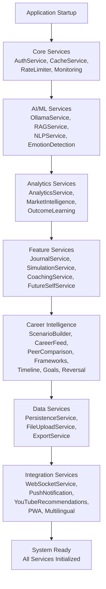
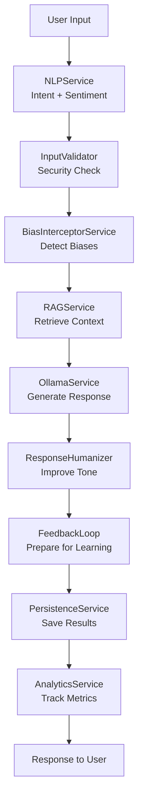
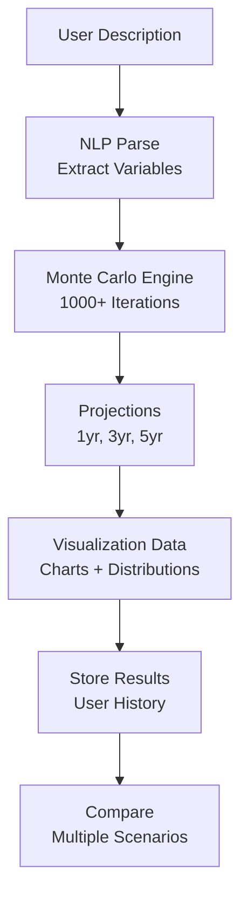

# Services Module

The services module contains 65+ microservices that provide specialized functionality for the StepWise AI System. Each service is designed to be modular, scalable, and independently deployable.

## Table of Contents

- [Overview](#overview)
- [Architecture](#architecture)
- [Core Services](#core-services)
- [AI and ML Services](#ai-and-ml-services)
- [Analytics and Insights Services](#analytics-and-insights-services)
- [User Experience Services](#user-experience-services)
- [Decision Support Services](#decision-support-services)
- [Data Management Services](#data-management-services)
- [Integration Services](#integration-services)
- [Career Intelligence Services](#career-intelligence-services)
- [Service Initialization](#service-initialization)
- [Cross-Service Communication](#cross-service-communication)

## Overview

The services layer provides:
- Separation of concerns through microservices architecture
- Reusable, testable components
- Async support for high performance
- Event-driven communication patterns
- Graceful degradation and fallback mechanisms

## Architecture

```mermaid
graph TD
    API["API Layer<br/>FastAPI"]

    subgraph Core["Core Tier"]
        A1["HardenedAuthService<br/>JWT, OAuth, Sessions"]
        A2["SecurityConfig<br/>CORS, Rate Limits"]
        A3["CacheService<br/>LRU + TTL"]
        A4["HardenedRateLimiter<br/>Token Bucket"]
        A5["MonitoringService<br/>Health, Metrics"]
        A6["AuditLogger<br/>Security Events"]
        A7["BruteForceProtector<br/>Lockout Management"]
    end

    subgraph Business["Business Logic Tier"]
        B1["OllamaService<br/>LLM Inference"]
        B2["EnhancedRegretPredictor<br/>ML Pipeline"]
        B3["RAGService<br/>ChromaDB + Embeddings"]
        B4["BiasInterceptorService<br/>Cognitive Bias Detection"]
        B5["JournalService<br/>Decision Journal"]
        B6["SimulationService<br/>Monte Carlo"]
        B7["FileUploadService<br/>Document Processing"]
        B8["ResumeParserService<br/>Resume Analysis"]
    end

    subgraph Analytics["Analytics Tier"]
        C1["AnalyticsService<br/>User Metrics"]
        C2["NLPService<br/>Intent, Sentiment"]
        C3["MarketIntelligenceService<br/>Salary, Trends"]
        C4["CommunityInsightsService<br/>Aggregated Patterns"]
        C5["GamificationService<br/>Points, Achievements"]
        C6["OpportunityScoutService<br/>Opportunity Detection"]
        C7["OutcomeLearningService<br/>Learn from Results"]
    end

    subgraph CareerIntel["Career Intelligence Tier"]
        F1["ScenarioBuilderService<br/>Monte Carlo What-Ifs"]
        F2["CareerFeedService<br/>Personalized Feed"]
        F3["PeerComparisonService<br/>Benchmarking"]
        F4["DecisionFrameworkService<br/>Rubrics"]
        F5["CareerTimelineService<br/>Milestones"]
        F6["GoalTrackingService<br/>SMART Goals"]
        F7["ReversalAnalyzerService<br/>Undo Decisions"]
        F8["MultilingualService<br/>i18n"]
    end

    subgraph Integration["Integration Tier"]
        D1["YouTubeRecommendationService"]
        D2["PushNotificationService"]
        D3["WebSocketService<br/>ConnectionManager"]
        D4["CalendarSyncService"]
        D5["EnterpriseIntegrationService"]
        D6["MentorMatchingService"]
        D7["PWAService<br/>Progressive Web App"]
    end

    subgraph Data["Data Tier"]
        E1["SQLAlchemy<br/>SQLite"]
        E2["ChromaDB<br/>Vector Store"]
        E3["Redis<br/>Session Cache"]
        E4["File Storage<br/>Uploads"]
    end

    API --> Core
    Core --> Business
    Business --> Analytics
    Analytics --> CareerIntel
    CareerIntel --> Integration
    Integration --> Data
```

### Service Dependency Graph

```mermaid
graph TD
    AUTH["AuthService"] --> CACHE["CacheService"]
    AUTH --> RATE["RateLimiter"]
    AUTH --> AUDIT["AuditLogger"]
    AUTH --> BRUTE["BruteForceProtector"]

    OLLAMA["OllamaService"] --> RAG["RAGService"]
    RAG --> CHROMA["ChromaDB"]

    NLP["NLPService"] --> EMOTION["EmotionDetectionService"]
    NLP --> BIAS["BiasInterceptorService"]
    NLP --> JOURNAL["JournalService"]

    UPLOAD["FileUploadService"] --> MEDIA["MediaIngestionService"]
    UPLOAD --> RESUME["ResumeParserService"]
    UPLOAD --> PERSIST["PersistenceService"]

    FEEDBACK["FeedbackLoop"] --> OUTCOME["OutcomeLearningService"]
    FEEDBACK --> ANALYTICS["AnalyticsService"]
    FEEDBACK --> BIAS

    SIM["SimulationService"] --> OLLAMA
    SIM --> GAMIFY["GamificationService"]
    SIM --> ROADMAP["RoadmapService"]

    COACH["CoachingService"] --> NLP
    COACH --> KNOWLEDGE["KnowledgeService"]
    COACH --> EXPORT["ExportService"]

    SCENARIO["ScenarioBuilderService"] --> OLLAMA
    FEED["CareerFeedService"] --> MARKET["MarketIntelligenceService"]
    PEER["PeerComparisonService"] --> ANALYTICS
    FRAMEWORK["DecisionFrameworkService"] --> OLLAMA
    TIMELINE["CareerTimelineService"] --> JOURNAL
    GOALS["GoalTrackingService"] --> OLLAMA
    REVERSAL["ReversalAnalyzerService"] --> OLLAMA
```

## Core Services

### Authentication and Security

**HardenedAuthService** (`auth_service.py`)
- User registration with input validation
- Login with PBKDF2-SHA256 password verification
- Session token creation and validation
- GitHub OAuth integration (register/login via gh_ prefix)
- Multi-factor authentication support
- IP whitelisting and blacklisting
- Failed attempt tracking and account lockout

**SecurityConfig** (`security.py`)
- Rate limiting configuration
- Request validation rules
- CORS policy management
- Input validation patterns (XSS, SQL injection, path traversal)
- Blocked patterns for malicious input detection

**AuditLogger** (`security.py`)
- Authentication event logging
- Authorization failure tracking
- Data access audit trail
- Configuration change records

### Caching and Rate Limiting

**CacheService** (`security.py`)
- In-memory caching with TTL-based expiration
- LRU eviction policy (configurable max size)
- Thread-safe operations
- Methods: `get(key)`, `set(key, value, ttl)`, `delete(key)`, `clear()`

**HardenedRateLimiter** (`security.py`)
- Token bucket algorithm
- Per-user and per-IP rate limits
- Sliding window for minute and hour quotas
- Automatic suspicious IP detection

**BruteForceProtector** (`security.py`)
- Track failed login attempts per user and IP
- Automatic lockout after configurable threshold (default: 5 attempts)
- Lockout duration: configurable (default: 15 minutes)

### Monitoring

**MonitoringDashboardService** (`monitoring_dashboard_service.py`)
- Request/response metrics collection
- Error rates and types tracking
- Service availability checks
- Real-time dashboard data aggregation
- Methods: `get_dashboard_data()`, `record_request()`, `get_service_health()`

## AI and ML Services

### Language Model Services

**OllamaService / EnhancedOllamaService** (`ollama_service.py`)
- Local LLM inference engine (llama3.2)
- Prompt formatting and response generation
- Connection health monitoring
- Task complexity classification for token optimization
- Configuration: base URL, model, temperature, max tokens

**MultiLLMService** (`multi_llm_service.py`)
- Multi-model orchestration
- Model selection based on task complexity
- Fallback routing between providers
- Cost optimization

### Knowledge and Retrieval

**RAGService** (`rag_service.py`)
- Retrieval-Augmented Generation using ChromaDB
- SentenceTransformers for vector embeddings (all-MiniLM-L6-v2)
- Document indexing and retrieval
- Media content indexing
- Methods: `retrieve(query, top_k)`, `add_document(id, category, title, content)`, `get_context_for_decision(type, description)`

**KnowledgeService** (`knowledge_service.py`)
- Career knowledge base management
- Domain-specific information retrieval
- Knowledge graph queries

### Natural Language Processing

**NLPService** (`nlp_service.py`)
- Intent classification (career_advice, decision_analysis, emotional_support, etc.)
- Sentiment analysis (positive/negative/neutral with score)
- Entity recognition (roles, companies, skills, locations)
- Text summarization
- Methods: `classify_intent(text)`, `analyze_sentiment(text)`, `extract_entities(text)`

**EmotionDetectionService** (`emotion_detection_service.py`)
- Primary emotion detection (joy, fear, anger, sadness, surprise, disgust)
- Emotional intensity levels (1-10)
- Decision stress level assessment
- Cognitive bias indicators from emotional patterns
- Enhanced emotion service for multi-dimensional analysis

### Decision Support

**BiasInterceptorService** (`bias_interceptor_service.py`)
- Detects: sunk cost fallacy, confirmation bias, availability bias, anchoring, overconfidence, status quo bias, loss aversion
- Real-time bias alerts during conversations
- Methods: `detect_biases(decision)`, `suggest_mitigation(bias)`, `get_bias_score(decision)`

**FeedbackLoop / AdvancedFeedbackLoop** (`feedback_service.py`)
- Continuous learning from user feedback
- Outcome-based model improvement
- Sentiment tracking across interactions
- Methods: `add_feedback(type, content)`, `analyze_feedback()`, `improve_recommendations()`

**ProactiveSuggestionService** (`proactive_suggestion_service.py`)
- Context-aware career suggestions
- Timing-optimized recommendations
- Trigger-based suggestion delivery
- Methods: `get_suggestions(user_id)`, `check_triggers(user_context)`

## Analytics and Insights Services

**AnalyticsService** (`analytics.py`)
- Decision frequency tracking
- User engagement metrics
- Feature usage analytics
- Methods: `get_user_analytics(user_id)`, `get_trends(user_id)`, `generate_report(user_id)`

**AdvancedAnalyticsService** (`advanced_analytics_service.py`)
- Deep pattern analysis
- Predictive analytics
- Cohort analysis
- A/B testing metrics

**MarketIntelligenceService** (`market_intelligence_service.py`)
- Salary benchmarking across 15+ roles and 16 locations
- Industry health scores
- Skill demand forecasting
- Methods: `get_salary_data(role, location)`, `get_industry_trends(industry)`

**CommunityInsightsService** (`community_insights_service.py`)
- Anonymized decision pattern aggregation
- Success rate calculations
- Common regret patterns
- Popular career transitions

**OutcomeLearningService** (`outcome_learning_service.py`)
- Record and analyze decision outcomes
- Pattern extraction from historical data
- Regret model improvement
- Methods: `record_outcome(decision_id, outcome)`, `get_outcome_distribution(type)`

**OutcomeTrackerService** (`outcome_tracker_service.py`)
- Long-term outcome monitoring
- Prediction accuracy tracking
- Outcome comparison against initial analysis

**SimulationService** (`simulation_service.py`)
- Monte Carlo career path simulation
- Scenario modeling and comparison
- Sensitivity analysis
- Methods: `simulate_career_path(decision)`, `compare_scenarios(scenarios)`

## User Experience Services

**CoachingService** (`coaching_service.py`)
- Decision guidance and interview preparation
- Career planning and skill development
- Negotiation tactics
- Methods: `get_coaching_session(user_id)`, `generate_action_plan(goals)`

**FutureSelfService** (`future_self_service.py`)
- 5-year projection with multiple timeline scenarios
- Goal setting and tracking
- Life balance assessment

**DecisionTemplateService** (`decision_template_service.py`)
- Structured templates: job offer evaluation, career switch, education decision, skill planning
- Custom template creation
- Template scoring and recommendation

**GamificationService** (`gamification_service.py`)
- Points and leveling system
- 13 achievements across categories
- Daily challenges and streaks
- Methods: `add_achievement(user_id, achievement)`, `get_user_level(user_id)`

**VoiceSpeechService** (`voice_speech_service.py`)
- Speech-to-text (Whisper with browser fallback)
- Text-to-speech (pyttsx3/gTTS with browser fallback)
- Voice personas for future self simulation

**ResponseHumanizer** (`humanizer.py`)
- Tone adjustment for AI responses
- Empathy injection
- Conversational style adaptation

## Decision Support Services

**ScenarioBuilderService** (`scenario_builder_service.py`)
- Natural language scenario parsing
- Monte Carlo simulations (1000+ iterations)
- Multi-variable outcome projections (salary, satisfaction, growth)
- Scenario chaining (sequential what-ifs)
- Side-by-side scenario comparison
- API: `POST /api/scenario/create`, `POST /api/scenario/compare`, `GET /api/scenario/list/{user_id}`

**DecisionFrameworkService** (`decision_framework_service.py`)
- Six structured frameworks:
  - Job Offer Evaluator (compensation, growth, culture, work-life)
  - BATNA Analyzer (best alternative to negotiated agreement)
  - Career Pivot Scorecard (transferable skills, market demand)
  - Promotion Readiness (leadership, impact, visibility)
  - Startup Risk Evaluator (founding team, market, runway)
  - Remote Work Fit (discipline, collaboration, environment)
- Per-dimension scoring with sliders (1-5)
- AI-generated analysis, strengths, concerns, and verdict
- API: `GET /api/frameworks/list`, `POST /api/frameworks/quick-score`, `GET /api/frameworks/history/{user_id}`

**ReversalAnalyzerService** (`reversal_analyzer_service.py`)
- Decision reversibility scoring (0-100)
- Cost breakdown: financial, career reputation, emotional, opportunity
- Time-decay modeling (reversibility decreases over time)
- Optimal timing window calculation
- Step-by-step reversal roadmap generation
- Partial correction alternatives
- API: `POST /api/reversal/analyze`, `GET /api/reversal/history/{user_id}`

**PeerComparisonService** (`peer_comparison_service.py`)
- Anonymous peer profile registration (role, industry, experience)
- Cohort matching and comparison
- Aggregated decision statistics
- Regret distribution analysis
- Contribution and data enrichment
- API: `POST /api/peers/register`, `GET /api/peers/comparison/{user_id}`, `GET /api/peers/distribution/{user_id}/{decision_type}`

## Career Intelligence Services

**CareerFeedService** (`career_feed_service.py`)
- Personalized content generation based on user profile
- Feed item types: salary trend, skill gap, industry news, opportunity, market insight
- Relevance scoring and ranking
- Bookmark, dismiss, and read tracking
- User preference management
- Feed statistics and engagement metrics
- API: `POST /api/feed/preferences/{user_id}`, `GET /api/feed/{user_id}`, `POST /api/feed/bookmark/{user_id}/{item_id}`, `GET /api/feed/stats/{user_id}`

**CareerTimelineService** (`career_timeline_service.py`)
- Milestone tracking: decisions, achievements, role changes, salary changes, skills, goals
- Metric snapshot recording (salary, satisfaction, skill level)
- Timeline data retrieval with chronological ordering
- Progress report generation with velocity metrics
- Export in JSON and Markdown formats
- API: `POST /api/timeline/milestone`, `POST /api/timeline/metric-snapshot`, `GET /api/timeline/{user_id}`, `GET /api/timeline/report/{user_id}`, `GET /api/timeline/export/{user_id}`

**GoalTrackingService** (`goal_tracking_service.py`)
- SMART goal creation with AI-generated sub-tasks
- Goal categories: career, skill, financial, network, education
- Progress tracking and check-ins
- Sub-task completion tracking
- Weekly accountability report generation
- Goal templates for common objectives
- API: `POST /api/goals/create`, `GET /api/goals/{user_id}`, `POST /api/goals/subtask/complete`, `POST /api/goals/checkin`, `GET /api/goals/accountability/{user_id}`, `GET /api/goals/templates`

**OpportunityScoutService** (`opportunity_scout_service.py`)
- Market opportunity detection
- Skill-opportunity matching
- Hidden career path identification
- Timing optimization

## Data Management Services

**FileUploadService** (`file_upload_service.py`)
- Document processing (PDF, DOCX, XLSX, CSV)
- Image and video upload
- Content extraction
- Methods: `process_file(content, filename)`, `get_user_files(user_id)`

**ResumeParserService** (`resume_parser_service.py`)
- Contact information extraction
- Work experience, education, skills parsing
- Certifications and achievements
- Job matching and skill gap analysis
- ATS compatibility scoring
- Methods: `parse_resume(content)`, `extract_skills(resume)`

**MediaIngestionService** (`media_ingestion_service.py`)
- URL content extraction
- YouTube video processing
- Image and video metadata extraction
- Content indexing for RAG

**ExportService** (`export_service.py`)
- JSON, PDF, and Text format exports
- Report generation
- Methods: `generate_report(user_id)`, `export_data(user_id, format)`

**ExportImportService** (`export_import_service.py`)
- Bulk data export and import
- Format conversion
- Data migration tools

**PersistenceService** (`persistence_service.py`)
- Database operations and transaction management
- Backup mechanisms
- Data integrity enforcement

**DatabaseService** (`database_service.py`)
- SQLAlchemy ORM operations
- Schema management
- Query optimization

**DataPrivacyService** (`data_privacy_service.py`)
- GDPR compliance
- Data anonymization
- Consent management with granular controls
- Encryption at rest (EncryptionService)
- Methods: `anonymize_user_data(user_id)`, `export_user_data(user_id)`, `delete_user_data(user_id)`

**MigrationService** (`migration_service.py`)
- Database schema migrations
- Version tracking
- Rollback support

## Integration Services

**YouTubeRecommendationService** (`youtube_recommendation_service.py`)
- Career-related video recommendations
- Learning path suggestions
- Content quality filtering
- Category-based filtering (tutorials, talks, courses, podcasts)

**WebSocketService / ConnectionManager** (`websocket_service.py`)
- Real-time bidirectional communication
- Live notifications
- Streaming responses
- Collaboration features
- Methods: `connect(client_id)`, `disconnect(client_id)`, `broadcast(message)`

**CalendarSyncService** (`calendar_sync_service.py`)
- Google Calendar integration
- Event scheduling and reminders
- Decision deadline tracking
- Career event types (interview, review, deadline, networking, training)

**EnterpriseIntegrationService** (`enterprise_integration_service.py`)
- SSO and SAML support
- Webhooks (Slack, Zapier)
- Custom API endpoints

**MentorMatchingService** (`mentor_matching_service.py`)
- AI-powered mentor identification
- Skill and experience matching
- Methods: `find_mentors(user_id)`, `suggest_mentorship(user_id)`

**PushNotificationService** (`push_notification_service.py`)
- Browser push notifications (Web Push API)
- Notification types: reminder, insight, achievement, alert, recommendation
- Priority levels: low, normal, high, urgent
- Scheduled notification delivery

**ScheduledCheckInService** (`scheduled_checkin_service.py`)
- Automated decision check-ins at 30, 90, and 180 days
- Weekly, biweekly, and monthly schedules
- Outcome recording prompts
- Decision satisfaction surveys

**ExternalIntegrationService** (`external_integration_service.py`)
- API key management
- Webhook configuration
- Third-party data sync

**MultilingualService** (`multilingual_service.py`)
- Interface translation (20+ languages)
- Currency formatting by locale
- Cultural context adaptation
- Right-to-left language support

**PWAService** (`pwa_service.py`)
- Progressive Web App manifest generation
- Service worker management
- Offline-first capabilities
- App install prompts

**ABTestingService** (`ab_testing_service.py`)
- Feature flag management
- A/B test experiment tracking
- Variant assignment and metrics

**AIPersonalizationService** (`ai_personalization_service.py`)
- User preference learning
- Response style adaptation
- Personalized prompt construction

**DecisionComparisonService** (`decision_comparison_service.py`)
- Side-by-side decision comparison
- Weighted criteria evaluation
- Recommendation generation

**DecisionSharingService** (`decision_sharing_service.py`)
- Shareable decision links
- Collaborative decision-making

**FineTuningService** (`fine_tuning_service.py`)
- Model fine-tuning pipeline
- Training data preparation
- Model versioning

**EnhancedAnalyticsService** (`enhanced_analytics_service.py`)
- Advanced visualization data
- Trend forecasting
- Anomaly detection

**GlobalRegretDatabase** (`global_regret_db.py`)
- Anonymized global regret patterns
- Cross-user trend analysis
- Benchmark data

**MultiverseVisualizationService** (`multiverse_viz_service.py`)
- 3D career path visualization data
- Branch point calculations
- Outcome probability trees

**RoadmapService** (`roadmap_service.py`)
- Career roadmap generation
- Milestone planning
- Timeline visualization

## Service Initialization

```mermaid
graph TD
    START["Application Startup"] --> CORE["Core Services<br/>AuthService, CacheService,<br/>RateLimiter, Monitoring"]
    CORE --> AIML["AI/ML Services<br/>OllamaService, RAGService,<br/>NLPService, EmotionDetection"]
    AIML --> ANALYTICS["Analytics Services<br/>AnalyticsService,<br/>MarketIntelligence,<br/>OutcomeLearning"]
    ANALYTICS --> FEATURE["Feature Services<br/>JournalService, SimulationService,<br/>CoachingService, FutureSelfService"]
    FEATURE --> CAREER["Career Intelligence<br/>ScenarioBuilder, CareerFeed,<br/>PeerComparison, Frameworks,<br/>Timeline, Goals, Reversal"]
    CAREER --> DATAMGMT["Data Services<br/>PersistenceService,<br/>FileUploadService,<br/>ExportService"]
    DATAMGMT --> INTEGRATION["Integration Services<br/>WebSocketService,<br/>PushNotification,<br/>YouTubeRecommendations,<br/>PWA, Multilingual"]
    INTEGRATION --> READY["System Ready<br/>All Services Initialized"]
```

## Cross-Service Communication

### Communication Patterns

**Event-Driven Communication**
- Services publish events asynchronously
- Subscriber services listen and react
- Decoupled architecture
- Example: Decision recorded triggers analytics update

**Request-Response Communication**
- Direct synchronous service calls
- Used for high-priority operations
- Example: Get user context for chat response

**Batch Processing Communication**
- Background job processing
- Asynchronous bulk operations
- Example: Monthly accountability report generation

### Decision Analysis Workflow

```mermaid
graph TD
    INPUT["User Input"] --> NLP["NLPService<br/>Intent + Sentiment"]
    NLP --> VALIDATE["InputValidator<br/>Security Check"]
    VALIDATE --> BIAS["BiasInterceptorService<br/>Detect Biases"]
    BIAS --> RAG["RAGService<br/>Retrieve Context"]
    RAG --> LLM["OllamaService<br/>Generate Response"]
    LLM --> HUMANIZE["ResponseHumanizer<br/>Improve Tone"]
    HUMANIZE --> FEEDBACK["FeedbackLoop<br/>Prepare for Learning"]
    FEEDBACK --> PERSIST["PersistenceService<br/>Save Results"]
    PERSIST --> ANALYTICS["AnalyticsService<br/>Track Metrics"]
    ANALYTICS --> OUTPUT["Response to User"]
```

### Scenario Analysis Workflow

```mermaid
graph TD
    DESC["User Description"] --> PARSE["NLP Parse<br/>Extract Variables"]
    PARSE --> MODEL["Monte Carlo Engine<br/>1000+ Iterations"]
    MODEL --> PROJ["Projections<br/>1yr, 3yr, 5yr"]
    PROJ --> VIZ["Visualization Data<br/>Charts + Distributions"]
    VIZ --> STORE["Store Results<br/>User History"]
    STORE --> COMPARE["Compare<br/>Multiple Scenarios"]
```

## Configuration

Services share configuration from `config.py`:

| Parameter | Default | Description |
|-----------|---------|-------------|
| OLLAMA_BASE_URL | http://localhost:11434 | Ollama API endpoint |
| OLLAMA_MODEL | llama3.2 | LLM model name |
| CHROMA_PERSIST_DIR | ./chroma_db | ChromaDB storage path |
| EMBEDDING_MODEL | all-MiniLM-L6-v2 | Sentence transformer model |
| CACHE_MAX_SIZE | 500 | Maximum cache entries |
| CACHE_TTL | 300 | Cache time-to-live (seconds) |
| RATE_LIMIT_RPM | 30 | Requests per minute |
| RATE_LIMIT_RPH | 500 | Requests per hour |
| MAX_LOGIN_ATTEMPTS | 5 | Before account lockout |
| LOCKOUT_DURATION_MINUTES | 15 | Lockout period |

## Complete Service Inventory

| # | Service | File | Size | Purpose |
|---|---------|------|------|---------|
| 1 | ABTestingService | `ab_testing_service.py` | 1.6 KB | Feature flags and A/B experiments |
| 2 | AdvancedAnalyticsService | `advanced_analytics_service.py` | 16.2 KB | Deep pattern and predictive analytics |
| 3 | AIPersonalizationService | `ai_personalization_service.py` | 13.5 KB | Response personalization |
| 4 | AnalyticsService | `analytics.py` | 6.2 KB | User metrics and engagement tracking |
| 5 | AuthService | `auth_service.py` | 9.3 KB | User authentication and sessions |
| 6 | BiasInterceptorService | `bias_interceptor_service.py` | 17.2 KB | Cognitive bias detection |
| 7 | CalendarSyncService | `calendar_sync_service.py` | 15.4 KB | Google Calendar integration |
| 8 | CareerFeedService | `career_feed_service.py` | 18.1 KB | Personalized career intelligence feed |
| 9 | CareerTimelineService | `career_timeline_service.py` | 15.8 KB | Career milestone timeline |
| 10 | CoachingService | `coaching_service.py` | 23.1 KB | Decision coaching and career planning |
| 11 | CommunityInsightsService | `community_insights_service.py` | 21.2 KB | Anonymized community patterns |
| 12 | DatabaseService | `database_service.py` | 38.5 KB | ORM operations and schema management |
| 13 | DataPrivacyService | `data_privacy_service.py` | 14.2 KB | GDPR compliance and encryption |
| 14 | DecisionComparisonService | `decision_comparison_service.py` | 13.2 KB | Side-by-side decision comparison |
| 15 | DecisionFrameworkService | `decision_framework_service.py` | 30.4 KB | Structured decision rubrics |
| 16 | DecisionSharingService | `decision_sharing_service.py` | 1.4 KB | Shareable decision links |
| 17 | DecisionTemplateService | `decision_template_service.py` | 31.0 KB | Decision analysis templates |
| 18 | EmotionDetectionService | `emotion_detection_service.py` | 18.5 KB | Emotion and stress detection |
| 19 | EnhancedAnalyticsService | `enhanced_analytics_service.py` | 16.3 KB | Advanced analytics and forecasting |
| 20 | EnhancedEmotionService | `enhanced_emotion_service.py` | 10.6 KB | Multi-dimensional emotion analysis |
| 21 | EnterpriseIntegrationService | `enterprise_integration_service.py` | 1.8 KB | SSO, SAML, webhooks |
| 22 | ExportImportService | `export_import_service.py` | 16.0 KB | Bulk data export/import |
| 23 | ExportService | `export_service.py` | 13.1 KB | JSON, PDF, Text exports |
| 24 | ExternalIntegrationService | `external_integration_service.py` | 11.5 KB | API keys and webhooks |
| 25 | FeedbackLoop | `feedback_service.py` | 20.2 KB | Continuous learning pipeline |
| 26 | FileUploadService | `file_upload_service.py` | 18.0 KB | Document and media upload |
| 27 | FineTuningService | `fine_tuning_service.py` | 1.7 KB | Model fine-tuning pipeline |
| 28 | FutureSelfService | `future_self_service.py` | 10.0 KB | 5-year career projections |
| 29 | GamificationService | `gamification_service.py` | 22.6 KB | Points, levels, achievements |
| 30 | GlobalRegretDatabase | `global_regret_db.py` | 13.9 KB | Anonymized regret patterns |
| 31 | GoalTrackingService | `goal_tracking_service.py` | 18.4 KB | SMART goal management |
| 32 | ResponseHumanizer | `humanizer.py` | 17.5 KB | AI response tone adjustment |
| 33 | JournalService | `journal_service.py` | 13.5 KB | Decision journal |
| 34 | KnowledgeService | `knowledge_service.py` | 1.4 KB | Career knowledge base |
| 35 | MarketIntelligenceService | `market_intelligence_service.py` | 18.3 KB | Salary and market data |
| 36 | MediaIngestionService | `media_ingestion_service.py` | 18.5 KB | URL and media processing |
| 37 | MentorMatchingService | `mentor_matching_service.py` | 6.2 KB | AI mentor matching |
| 38 | MigrationService | `migration_service.py` | 3.2 KB | Database migrations |
| 39 | MonitoringDashboardService | `monitoring_dashboard_service.py` | 15.2 KB | Real-time system monitoring |
| 40 | MultiLLMService | `multi_llm_service.py` | 1.8 KB | Multi-model orchestration |
| 41 | MultilingualService | `multilingual_service.py` | 21.5 KB | i18n and locale support |
| 42 | MultiverseVisualizationService | `multiverse_viz_service.py` | 15.9 KB | 3D career path visualization |
| 43 | NLPService | `nlp_service.py` | 27.3 KB | Intent, sentiment, entities |
| 44 | NotificationService | `notification_service.py` | 9.1 KB | In-app notifications |
| 45 | OllamaService | `ollama_service.py` | 24.7 KB | Local LLM inference |
| 46 | OpportunityScoutService | `opportunity_scout_service.py` | 16.4 KB | Market opportunity detection |
| 47 | OutcomeLearningService | `outcome_learning_service.py` | 10.5 KB | Learn from past outcomes |
| 48 | OutcomeTrackerService | `outcome_tracker_service.py` | 14.8 KB | Long-term outcome monitoring |
| 49 | PeerComparisonService | `peer_comparison_service.py` | 15.1 KB | Anonymous peer benchmarking |
| 50 | PersistenceService | `persistence_service.py` | 18.5 KB | Data persistence and backup |
| 51 | ProactiveSuggestionService | `proactive_suggestion_service.py` | 17.3 KB | Context-aware suggestions |
| 52 | PushNotificationService | `push_notification_service.py` | 10.5 KB | Browser push notifications |
| 53 | PWAService | `pwa_service.py` | 13.2 KB | Progressive Web App support |
| 54 | RAGService | `rag_service.py` | 15.9 KB | ChromaDB retrieval-augmented gen |
| 55 | ResumeParserService | `resume_parser_service.py` | 31.5 KB | Resume parsing and analysis |
| 56 | ReversalAnalyzerService | `reversal_analyzer_service.py` | 19.6 KB | Decision reversibility analysis |
| 57 | RoadmapService | `roadmap_service.py` | 2.2 KB | Career roadmap generation |
| 58 | ScenarioBuilderService | `scenario_builder_service.py` | 16.6 KB | What-if Monte Carlo simulations |
| 59 | ScheduledCheckInService | `scheduled_checkin_service.py` | 14.6 KB | Automated decision check-ins |
| 60 | SecurityConfig | `security.py` | 41.8 KB | Full security stack |
| 61 | SimulationService | `simulation_service.py` | 4.2 KB | Career path simulation |
| 62 | VoiceSpeechService | `voice_speech_service.py` | 9.3 KB | STT/TTS support |
| 63 | WebSocketService | `websocket_service.py` | 10.6 KB | Real-time communication |
| 64 | YouTubeRecommendationService | `youtube_recommendation_service.py` | 23.4 KB | Career video recommendations |

## Troubleshooting

Check service status:
- `MonitoringService.get_metrics()` -- overall health
- Individual service logs -- specific issues
- `/api/health` endpoint -- service health checks
- `/api/monitoring` endpoint -- real-time dashboard data

Common issues:
- **OllamaService connection** -- verify Ollama is running on configured port
- **RAG service** -- check ChromaDB initialization and embedding model download
- **Authentication** -- verify JWT_SECRET_KEY is set in .env
- **Rate limiting** -- check if IP is temporarily blocked after too many requests
- **File uploads** -- verify upload directory permissions and file size limits
- **Scenario Builder** -- requires valid user_id and scenario description
- **Career Feed** -- set preferences first via `/api/feed/preferences/{user_id}` before fetching feed
- **Peer Comparison** -- register profile via `/api/peers/register` before requesting comparisons
- **Goal Tracking** -- goals require category, title, and deadline fields
