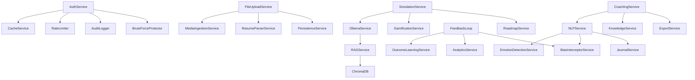
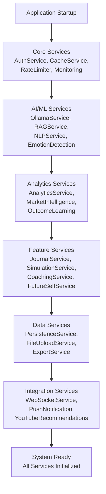
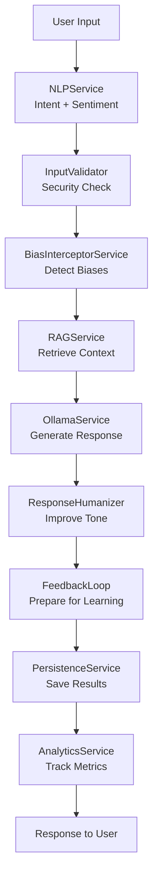

# Services Module

The services module contains 50+ microservices that provide specialized functionality for the Career Decision Regret System. Each service is designed to be modular, scalable, and independently deployable.

## Table of Contents

- [Overview](#overview)
- [Architecture](#architecture)
- [Core Services](#core-services)
- [AI and ML Services](#ai-and-ml-services)
- [Analytics and Insights Services](#analytics-and-insights-services)
- [User Experience Services](#user-experience-services)
- [Data Management Services](#data-management-services)
- [Integration Services](#integration-services)
- [Service Initialization](#service-initialization)
- [Cross-Service Communication](#cross-service-communication)

## Overview

The services layer provides:
- Separation of concerns through microservices architecture
- Reusable, testable components
- Async support for high performance
- Event-driven communication patterns
- Graceful degradation and fallback mechanisms

## Architecture

```mermaid
graph TD
    API["API Layer<br/>FastAPI"]

    subgraph Core["Core Tier"]
        A1["HardenedAuthService<br/>JWT, OAuth, Sessions"]
        A2["SecurityConfig<br/>CORS, Rate Limits"]
        A3["CacheService<br/>LRU + TTL"]
        A4["HardenedRateLimiter<br/>Token Bucket"]
        A5["MonitoringService<br/>Health, Metrics"]
        A6["AuditLogger<br/>Security Events"]
        A7["BruteForceProtector<br/>Lockout Management"]
    end

    subgraph Business["Business Logic Tier"]
        B1["OllamaService<br/>LLM Inference"]
        B2["EnhancedRegretPredictor<br/>ML Pipeline"]
        B3["RAGService<br/>ChromaDB + Embeddings"]
        B4["BiasInterceptorService<br/>Cognitive Bias Detection"]
        B5["JournalService<br/>Decision Journal"]
        B6["SimulationService<br/>Monte Carlo"]
        B7["FileUploadService<br/>Document Processing"]
        B8["ResumeParserService<br/>Resume Analysis"]
    end

    subgraph Analytics["Analytics Tier"]
        C1["AnalyticsService<br/>User Metrics"]
        C2["NLPService<br/>Intent, Sentiment"]
        C3["MarketIntelligenceService<br/>Salary, Trends"]
        C4["CommunityInsightsService<br/>Aggregated Patterns"]
        C5["GamificationService<br/>Points, Achievements"]
        C6["OpportunityScoutService<br/>Opportunity Detection"]
        C7["OutcomeLearningService<br/>Learn from Results"]
    end

    subgraph Integration["Integration Tier"]
        D1["YouTubeRecommendationService"]
        D2["PushNotificationService"]
        D3["WebSocketService<br/>ConnectionManager"]
        D4["CalendarSyncService"]
        D5["EnterpriseIntegrationService"]
        D6["MentorMatchingService"]
    end

    subgraph Data["Data Tier"]
        E1["SQLAlchemy<br/>SQLite"]
        E2["ChromaDB<br/>Vector Store"]
        E3["Redis<br/>Session Cache"]
        E4["File Storage<br/>Uploads"]
    end

    API --> Core
    Core --> Business
    Business --> Analytics
    Analytics --> Integration
    Integration --> Data
```

### Service Dependency Graph

```mermaid
graph TD
    AUTH["AuthService"] --> CACHE["CacheService"]
    AUTH --> RATE["RateLimiter"]
    AUTH --> AUDIT["AuditLogger"]
    AUTH --> BRUTE["BruteForceProtector"]

    OLLAMA["OllamaService"] --> RAG["RAGService"]
    RAG --> CHROMA["ChromaDB"]

    NLP["NLPService"] --> EMOTION["EmotionDetectionService"]
    NLP --> BIAS["BiasInterceptorService"]
    NLP --> JOURNAL["JournalService"]

    UPLOAD["FileUploadService"] --> MEDIA["MediaIngestionService"]
    UPLOAD --> RESUME["ResumeParserService"]
    UPLOAD --> PERSIST["PersistenceService"]

    FEEDBACK["FeedbackLoop"] --> OUTCOME["OutcomeLearningService"]
    FEEDBACK --> ANALYTICS["AnalyticsService"]
    FEEDBACK --> BIAS

    SIM["SimulationService"] --> OLLAMA
    SIM --> GAMIFY["GamificationService"]
    SIM --> ROADMAP["RoadmapService"]

    COACH["CoachingService"] --> NLP
    COACH --> KNOWLEDGE["KnowledgeService"]
    COACH --> EXPORT["ExportService"]
```

## Core Services

### Authentication and Security

**HardenedAuthService**
- User registration with input validation
- Login with PBKDF2-SHA256 password verification
- Session token creation and validation
- GitHub OAuth integration (register/login via gh_ prefix)
- Multi-factor authentication support
- IP whitelisting and blacklisting
- Failed attempt tracking and account lockout

**SecurityConfig**
- Rate limiting configuration
- Request validation rules
- CORS policy management
- Input validation patterns (XSS, SQL injection, path traversal)
- Blocked patterns for malicious input detection

**AuditLogger**
- Authentication event logging
- Authorization failure tracking
- Data access audit trail
- Configuration change records

### Caching and Rate Limiting

**CacheService**
- In-memory caching with TTL-based expiration
- LRU eviction policy (configurable max size)
- Thread-safe operations
- Methods: `get(key)`, `set(key, value, ttl)`, `delete(key)`, `clear()`

**HardenedRateLimiter**
- Token bucket algorithm
- Per-user and per-IP rate limits
- Sliding window for minute and hour quotas
- Automatic suspicious IP detection

**BruteForceProtector**
- Track failed login attempts per user and IP
- Automatic lockout after configurable threshold (default: 5 attempts)
- Lockout duration: configurable (default: 15 minutes)

### Monitoring

**MonitoringService**
- Request/response metrics
- Error rates and types
- Service availability tracking
- Methods: `record(endpoint)`, `get_metrics()`, `get_service_status()`

## AI and ML Services

### Language Model Services

**OllamaService**
- Local LLM inference engine (llama3.2)
- Prompt formatting and response generation
- Connection health monitoring
- Configuration: base URL, model, temperature, max tokens

**MultiLLMService**
- Multi-model orchestration
- Model selection based on task complexity
- Fallback routing between providers
- Cost optimization

### Knowledge and Retrieval

**RAGService**
- Retrieval-Augmented Generation using ChromaDB
- SentenceTransformers for vector embeddings (all-MiniLM-L6-v2)
- Document indexing and retrieval
- Media content indexing
- Methods: `retrieve(query, top_k)`, `add_document(id, category, title, content)`, `get_context_for_decision(type, description)`

### Natural Language Processing

**NLPService**
- Intent classification
- Sentiment analysis
- Entity recognition
- Text summarization
- Methods: `classify_intent(text)`, `analyze_sentiment(text)`, `extract_entities(text)`

**EmotionDetectionService**
- Primary emotion detection (joy, fear, anger, sadness)
- Emotional intensity levels
- Decision stress level assessment
- Cognitive bias indicators

### Decision Support

**BiasInterceptorService**
- Detects: sunk cost fallacy, confirmation bias, availability bias, anchoring, overconfidence
- Methods: `detect_biases(decision)`, `suggest_mitigation(bias)`, `get_bias_score(decision)`

**FeedbackLoop**
- Continuous learning from user feedback
- Methods: `add_feedback(type, content)`, `analyze_feedback()`, `improve_recommendations()`

**OpportunityScoutService**
- Market opportunity detection
- Skill-opportunity matching
- Hidden career path identification
- Timing optimization

## Analytics and Insights Services

**AnalyticsService**
- Decision frequency tracking
- User engagement metrics
- Feature usage analytics
- Methods: `get_user_analytics(user_id)`, `get_trends(user_id)`, `generate_report(user_id)`

**MarketIntelligenceService**
- Salary benchmarking across 15+ roles and 16 locations
- Industry health scores
- Skill demand forecasting
- Methods: `get_salary_data(role, location)`, `get_industry_trends(industry)`

**CommunityInsightsService**
- Anonymized decision pattern aggregation
- Success rate calculations
- Common regret patterns
- Popular career transitions

**OutcomeLearningService**
- Record and analyze decision outcomes
- Pattern extraction from historical data
- Regret model improvement
- Methods: `record_outcome(decision_id, outcome)`, `get_outcome_distribution(type)`

**SimulationService**
- Monte Carlo career path simulation
- Scenario modeling and comparison
- Sensitivity analysis
- Methods: `simulate_career_path(decision)`, `compare_scenarios(scenarios)`

## User Experience Services

**CoachingService**
- Decision guidance and interview preparation
- Career planning and skill development
- Negotiation tactics
- Methods: `get_coaching_session(user_id)`, `generate_action_plan(goals)`

**FutureSelfService**
- 5-year projection with multiple timeline scenarios
- Goal setting and tracking
- Life balance assessment

**DecisionTemplateService**
- Structured templates: job offer evaluation, career switch, education decision, skill planning

**GamificationService**
- Points and leveling system
- 13 achievements across categories
- Daily challenges and streaks
- Methods: `add_achievement(user_id, achievement)`, `get_user_level(user_id)`

**VoiceSpeechService**
- Speech-to-text (Whisper with browser fallback)
- Text-to-speech (pyttsx3/gTTS with browser fallback)
- Voice personas for future self simulation

## Data Management Services

**FileUploadService**
- Document processing (PDF, DOCX, XLSX, CSV)
- Image and video upload
- Content extraction
- Methods: `process_file(content, filename)`, `get_user_files(user_id)`

**ResumeParserService**
- Contact information extraction
- Work experience, education, skills parsing
- Certifications and achievements
- Job matching
- Methods: `parse_resume(content)`, `extract_skills(resume)`

**ExportService**
- JSON, PDF, and Text format exports
- Report generation
- Methods: `generate_report(user_id)`, `export_data(user_id, format)`

**PersistenceService**
- Database operations and transaction management
- Backup mechanisms
- Data integrity enforcement

**DataPrivacyService**
- GDPR compliance
- Data anonymization
- Consent management
- Methods: `anonymize_user_data(user_id)`, `export_user_data(user_id)`, `delete_user_data(user_id)`

## Integration Services

**YouTubeRecommendationService**
- Career-related video recommendations
- Learning path suggestions
- Content quality filtering

**WebSocketService / ConnectionManager**
- Real-time bidirectional communication
- Live notifications
- Streaming responses
- Methods: `connect(client_id)`, `disconnect(client_id)`, `broadcast(message)`

**CalendarSyncService**
- Google Calendar integration
- Event scheduling and reminders

**EnterpriseIntegrationService**
- SSO and SAML support
- Webhooks (Slack, Zapier)
- Custom API endpoints

**MentorMatchingService**
- AI-powered mentor identification
- Skill and experience matching
- Methods: `find_mentors(user_id)`, `suggest_mentorship(user_id)`

## Service Initialization

```mermaid
graph TD
    START["Application Startup"] --> CORE["Core Services<br/>AuthService, CacheService,<br/>RateLimiter, Monitoring"]
    CORE --> AIML["AI/ML Services<br/>OllamaService, RAGService,<br/>NLPService, EmotionDetection"]
    AIML --> ANALYTICS["Analytics Services<br/>AnalyticsService,<br/>MarketIntelligence,<br/>OutcomeLearning"]
    ANALYTICS --> FEATURE["Feature Services<br/>JournalService, SimulationService,<br/>CoachingService, FutureSelfService"]
    FEATURE --> DATAMGMT["Data Services<br/>PersistenceService,<br/>FileUploadService,<br/>ExportService"]
    DATAMGMT --> INTEGRATION["Integration Services<br/>WebSocketService,<br/>PushNotification,<br/>YouTubeRecommendations"]
    INTEGRATION --> READY["System Ready<br/>All Services Initialized"]
```

## Cross-Service Communication

### Communication Patterns

**Event-Driven Communication**
- Services publish events asynchronously
- Subscriber services listen and react
- Decoupled architecture
- Example: Decision recorded triggers analytics update

**Request-Response Communication**
- Direct synchronous service calls
- Used for high-priority operations
- Example: Get user context for chat response

**Batch Processing Communication**
- Background job processing
- Asynchronous bulk operations
- Example: Monthly report generation

### Decision Analysis Workflow

```mermaid
graph TD
    INPUT["User Input"] --> NLP["NLPService<br/>Intent + Sentiment"]
    NLP --> VALIDATE["InputValidator<br/>Security Check"]
    VALIDATE --> BIAS["BiasInterceptorService<br/>Detect Biases"]
    BIAS --> RAG["RAGService<br/>Retrieve Context"]
    RAG --> LLM["OllamaService<br/>Generate Response"]
    LLM --> HUMANIZE["ResponseHumanizer<br/>Improve Tone"]
    HUMANIZE --> FEEDBACK["FeedbackLoop<br/>Prepare for Learning"]
    FEEDBACK --> PERSIST["PersistenceService<br/>Save Results"]
    PERSIST --> ANALYTICS["AnalyticsService<br/>Track Metrics"]
    ANALYTICS --> OUTPUT["Response to User"]
```

## Configuration

Services share configuration from `config.py`:

| Parameter | Default | Description |
|-----------|---------|-------------|
| OLLAMA_BASE_URL | http://localhost:11434 | Ollama API endpoint |
| OLLAMA_MODEL | llama3.2 | LLM model name |
| CHROMA_PERSIST_DIR | ./chroma_db | ChromaDB storage path |
| EMBEDDING_MODEL | all-MiniLM-L6-v2 | Sentence transformer model |
| CACHE_MAX_SIZE | 500 | Maximum cache entries |
| CACHE_TTL | 300 | Cache time-to-live (seconds) |
| RATE_LIMIT_RPM | 30 | Requests per minute |
| RATE_LIMIT_RPH | 500 | Requests per hour |
| MAX_LOGIN_ATTEMPTS | 5 | Before account lockout |
| LOCKOUT_DURATION_MINUTES | 15 | Lockout period |

## Troubleshooting

Check service status:
- `MonitoringService.get_metrics()` -- overall health
- Individual service logs -- specific issues
- `/api/health` endpoint -- service health checks

Common issues:
- **OllamaService connection** -- verify Ollama is running on configured port
- **RAG service** -- check ChromaDB initialization and embedding model download
- **Authentication** -- verify JWT_SECRET_KEY is set in .env
- **Rate limiting** -- check if IP is temporarily blocked after too many requests
- **File uploads** -- verify upload directory permissions and file size limits
