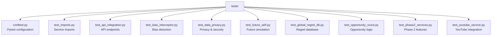
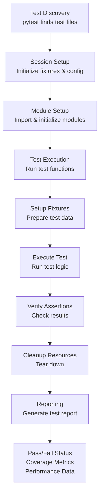
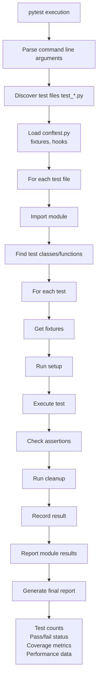

# Tests Module

Comprehensive testing suite for the Career Decision Regret System. This module contains unit tests, integration tests, and system tests for all components.

## Table of Contents

[Overview](#overview)
[Architecture](#architecture)
[Test Structure](#test-structure)
[Running Tests](#running-tests)
[Test Coverage](#test-coverage)
[Writing Tests](#writing-tests)
[Fixtures and Mocks](#fixtures-and-mocks)
[Best Practices](#best-practices)
[CI/CD Integration](#cicd-integration)

## Overview

The test suite ensures:
- Code reliability and correctness
- Regression prevention
- API contract compliance
- Integration between components
- Performance benchmarking
- Security validation

Test Framework: pytest
Async Support: pytest-asyncio
Mocking: unittest.mock and pytest fixtures
Coverage: pytest-cov
Performance: pytest-benchmark

## Architecture

### Tests Module Organization



### Test Execution Flow



## Test Structure

### Test File Organization

```
conftest.py
├── session fixtures (event_loop)
├── user fixtures (sample_user_id)
├── decision fixtures (sample_decision)
├── profile fixtures (sample_profile)
├── mocking utilities
└── configuration

test_imports.py
├── Service import tests
├── Module availability checks
└── Dependency verification

test_api_integration.py
├── Endpoint tests
├── Request/response validation
├── Error handling
└── Security checks

test_bias_interceptor.py
├── Bias detection tests
├── Bias type classification
├── Mitigation suggestions
└── Edge cases

test_data_privacy.py
├── Privacy control tests
├── GDPR compliance checks
├── Data anonymization tests
├── Encryption/decryption tests

test_future_self.py
├── Simulation tests
├── Projection accuracy
├── Scenario comparison
└── Timeline validation

test_global_regret_db.py
├── Aggregation tests
├── Pattern detection
├── Benchmark updates
└── Data consistency

test_opportunity_scout.py
├── Opportunity identification
├── Matching algorithms
├── Risk assessment
└── Recommendation quality

test_phase2_services.py
├── Feature integration
├── Cross-service workflows
├── Data flow validation
└── Performance tests

test_youtube_service.py
├── Video retrieval
├── Metadata extraction
├── Recommendation quality
└── Transcript handling
```

## Running Tests

### Run All Tests

```bash
pytest
```

### Run Specific Test File

```bash
pytest tests/test_imports.py -v
pytest tests/test_bias_interceptor.py -v
```

### Run Specific Test

```bash
pytest tests/test_imports.py::test_nlp_import -v
pytest tests/test_bias_interceptor.py::test_detect_sunk_cost_fallacy -v
```

### Run with Coverage

```bash
pytest --cov=services --cov=models --cov-report=html
```

### Run with Output

```bash
pytest -v                          # Verbose output
pytest -s                          # Show print statements
pytest -vv                         # Extra verbose
pytest --tb=short                  # Short traceback format
```

### Run Async Tests

```bash
pytest -k async -v                 # Run async tests
pytest tests/test_api_integration.py -v  # Tests with async
```

### Run with Markers

```bash
pytest -m unit                     # Only unit tests
pytest -m integration              # Only integration tests
pytest -m slow                     # Only slow tests
pytest -m "not slow"               # Skip slow tests
```

### Parallel Execution

```bash
pytest -n auto                     # Use all CPU cores
pytest -n 4                        # Use 4 workers
```

## Test Coverage

### Current Coverage

Coverage by module (estimated):
- services/: 75-85%
  - Core services: 85-90%
  - ML services: 70-80%
  - Integration services: 60-75%
- models/: 80-85%
  - ML pipeline: 85%
  - Graph engine: 80%
  - Database models: 85%
- API endpoints: 70-80%

### Coverage Report

```bash
pytest --cov=. --cov-report=html --cov-report=term
```

Generate coverage badge:
```bash
coverage-badge -o coverage.svg
```

View coverage:
- HTML: open htmlcov/index.html
- Terminal: pytest output
- Badge: coverage.svg

## Writing Tests

### Test Templates

Unit Test Template
```python
import pytest
from services.example_service import ExampleService

class TestExampleService:
    
    @pytest.fixture
    def service(self):
        return ExampleService()
    
    def test_basic_functionality(self, service):
        result = service.do_something()
        assert result is not None
        assert result["status"] == "success"
    
    def test_error_handling(self, service):
        with pytest.raises(ValueError):
            service.invalid_input("bad data")
    
    def test_edge_case(self, service):
        result = service.process_empty_data([])
        assert result == []
```

Async Test Template
```python
import pytest
from services.async_service import AsyncService

@pytest.mark.asyncio
async def test_async_operation():
    service = AsyncService()
    result = await service.async_method()
    assert result is not None

@pytest.mark.asyncio
async def test_async_error():
    service = AsyncService()
    with pytest.raises(Exception):
        await service.failing_method()
```

Integration Test Template
```python
import pytest
from fastapi.testclient import TestClient
from main import app

@pytest.fixture
def client():
    return TestClient(app)

def test_endpoint_integration(client):
    response = client.post("/api/analyze", json={
        "decision_type": "job_change",
        "description": "Test decision"
    })
    assert response.status_code == 200
    assert "analysis" in response.json()
```

### Best Practices for Writing Tests

Test Naming Convention
```
test_<function_name>_<condition>_<expected_result>

Examples:
test_predict_regret_with_valid_input_returns_score
test_detect_bias_with_sunk_cost_fallacy_identifies_correctly
test_empty_input_raises_value_error
```

Test Structure (Arrange-Act-Assert)
```python
def test_decision_analysis():
    # Arrange: Set up test data
    decision = {
        "type": "job_change",
        "description": "Switch to startup"
    }
    
    # Act: Execute the function
    result = analyze_decision(decision)
    
    # Assert: Verify results
    assert result["regret_score"] is not None
    assert result["confidence"] > 0.5
```

## Fixtures and Mocks

### Common Fixtures (conftest.py)

```python
@pytest.fixture
def sample_user_id():
    return "test_user_123"

@pytest.fixture
def sample_decision():
    return {
        "decision_type": "job_change",
        "description": "Switching from Company A to Company B",
        "predicted_regret": 35.0,
        "factors": ["salary", "growth", "culture"]
    }

@pytest.fixture
def sample_journal_entry():
    return {
        "title": "Career Decision Reflection",
        "content": "Considering my next move...",
        "emotions": ["anxious", "hopeful"],
        "decision_type": "job_change"
    }

@pytest.fixture
def sample_profile():
    return {
        "current_role": "Software Engineer",
        "industry": "technology",
        "skills": ["Python", "JavaScript", "ML"],
        "risk_tolerance": 0.6,
        "salary_target": 180000
    }
```

### Mocking External Services

```python
from unittest.mock import Mock, patch, AsyncMock

def test_with_mock_service():
    with patch('services.ollama_service.OllamaService') as mock:
        mock_instance = Mock()
        mock_instance.chat.return_value = "Mocked response"
        mock.return_value = mock_instance
        
        # Test code
        result = mock_instance.chat("test")
        assert result == "Mocked response"

@pytest.mark.asyncio
async def test_with_async_mock():
    with patch('services.rag_service.RAGService') as mock:
        mock_instance = AsyncMock()
        mock_instance.retrieve.return_value = ["result1", "result2"]
        mock.return_value = mock_instance
        
        # Test code
        results = await mock_instance.retrieve("query")
        assert len(results) == 2
```

## Test Categories

### Unit Tests

Focus: Individual functions/methods
Scope: Isolated from external dependencies
Speed: Fast (< 100ms per test)
Examples:
```python
test_predict_regret()           # ML prediction
test_classify_intent()          # NLP function
test_detect_bias()              # Bias detection
test_format_response()          # Response formatting
```

### Integration Tests

Focus: Multiple components working together
Scope: Services interacting
Speed: Medium (100ms - 1s per test)
Examples:
```python
test_decision_analysis_workflow()      # Multi-service flow
test_api_with_database()               # API + DB
test_nlp_with_bias_interceptor()       # Service combo
```

### API Tests

Focus: HTTP endpoints
Scope: Full request/response cycle
Speed: Medium to slow
Examples:
```python
test_post_decision_endpoint()
test_get_analytics_endpoint()
test_error_response_format()
```

### Performance Tests

Focus: Response time and throughput
Scope: Realistic workloads
Speed: Varies
Examples:
```python
test_batch_prediction_performance()
test_concurrent_requests()
test_large_dataset_processing()
```

## Test Execution Flow



## CI/CD Integration

### GitHub Actions Configuration

```yaml
name: Tests

on: [push, pull_request]

jobs:
  test:
    runs-on: ubuntu-latest
    
    steps:
    - uses: actions/checkout@v2
    
    - name: Set up Python
      uses: actions/setup-python@v2
      with:
        python-version: '3.11'
    
    - name: Install dependencies
      run: |
        pip install -r requirements.txt
        pip install pytest pytest-cov pytest-asyncio
    
    - name: Run tests
      run: pytest --cov=. --cov-report=xml
    
    - name: Upload coverage
      uses: codecov/codecov-action@v2
```

### Pre-commit Hooks

```bash
# .pre-commit-config.yaml
repos:
  - repo: local
    hooks:
      - id: pytest
        name: pytest
        entry: pytest
        language: system
        types: [python]
        stages: [commit]
```

## Known Issues and Limitations

### Async Testing
- Event loop fixture required for async tests
- Mock async functions with AsyncMock

### External Services
- YouTube API requires authentication
- Ollama service needs to be running
- Database tests use in-memory SQLite by default

### Performance Tests
- Results vary by system
- Use relative comparisons
- Run multiple times for consistency

## Debugging Tests

### Debug Mode

```bash
pytest -vv --tb=long            # Verbose with long traceback
pytest --pdb                     # Drop into debugger on failure
pytest --trace                   # Drop into debugger at start
```

### Print Debugging

```python
import logging
logging.basicConfig(level=logging.DEBUG)
logger = logging.getLogger(__name__)

def test_something():
    logger.debug("Debug message")
    print("Direct print")
    result = function_to_test()
    assert result
```

### Test Output

```bash
pytest -s                        # Show stdout
pytest -vv                       # Very verbose
pytest --tb=short               # Short traceback
pytest --tb=no                  # No traceback
```

## Continuous Improvement

### Metrics to Track

- Test pass rate (target: 100%)
- Code coverage (target: >80%)
- Test execution time (target: <10 min)
- False positive rate (target: 0%)
- Test flakiness (target: 0%)

### Adding New Tests

When adding features:
1. Write failing test first (TDD)
2. Implement feature
3. Verify test passes
4. Add edge case tests
5. Update documentation

## Test Checklist

Before committing:
- All tests pass locally
- Coverage increased or maintained
- No new warnings or errors
- Test names are descriptive
- Edge cases covered
- Error paths tested
- Integration points verified
- Documentation updated

## Troubleshooting

### Import Errors
- Check sys.path in conftest.py
- Verify module structure
- Test individual imports

### Fixture Issues
- Check fixture scope
- Verify dependencies
- Look for circular references

### Async Issues
- Use @pytest.mark.asyncio
- Use AsyncMock for mocking
- Check event loop fixture

### Database Issues
- Clear test database between runs
- Use in-memory SQLite for tests
- Check transaction handling

## Performance Benchmarking

### Benchmark Template

```python
def test_prediction_performance(benchmark):
    predictor = EnhancedRegretPredictor()
    features = {"type": "job_change", ...}
    
    # Benchmark the function
    result = benchmark(predictor.predict_regret, features)
    assert result is not None

# Run with: pytest --benchmark-only
```

## Resources

- pytest documentation: https://docs.pytest.org/
- pytest-asyncio: https://docs.pytest.org/
- Coverage.py: https://coverage.readthedocs.io/
- unittest.mock: https://docs.python.org/3/library/unittest.mock.html

## Summary

This test suite ensures the Career Decision Regret System maintains:
- Code quality and reliability
- Performance standards
- Security and privacy
- API contracts
- Component integration
- User experience consistency

Run tests regularly, especially before deployment, to catch issues early and maintain system stability.
