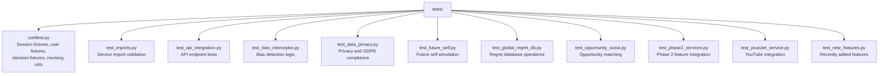
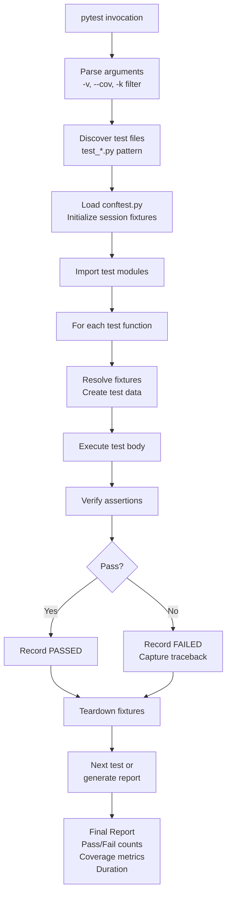
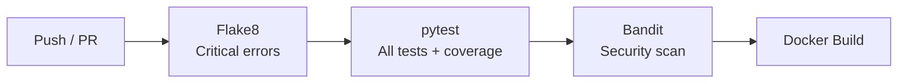

# Tests Module

Comprehensive testing suite for the Career Decision Regret System. This module contains unit tests, integration tests, and system tests for all components.

## Table of Contents

- [Overview](#overview)
- [Architecture](#architecture)
- [Test Structure](#test-structure)
- [Running Tests](#running-tests)
- [Test Coverage](#test-coverage)
- [Writing Tests](#writing-tests)
- [Fixtures and Mocks](#fixtures-and-mocks)
- [CI/CD Integration](#cicd-integration)

## Overview

The test suite ensures:
- Code reliability and correctness
- Regression prevention
- API contract compliance
- Integration between components
- Security validation

| Tool | Purpose |
|------|---------|
| pytest | Test framework |
| pytest-asyncio | Async test support |
| pytest-cov | Coverage reporting |
| unittest.mock | Mocking and patching |
| httpx | Async HTTP client for API tests |

## Architecture

### Test Module Organization


```mermaid
graph TD
    ROOT["tests/"]
    ROOT --> CONF["conftest.py<br/>Session fixtures, user fixtures,<br/>decision fixtures, mocking utils"]
    ROOT --> IMP["test_imports.py<br/>Service import validation"]
    ROOT --> API["test_api_integration.py<br/>API endpoint tests"]
    ROOT --> BIAS["test_bias_interceptor.py<br/>Bias detection logic"]
    ROOT --> PRIV["test_data_privacy.py<br/>Privacy and GDPR compliance"]
    ROOT --> FUTURE["test_future_self.py<br/>Future self simulation"]
    ROOT --> REGRET["test_global_regret_db.py<br/>Regret database operations"]
    ROOT --> OPP["test_opportunity_scout.py<br/>Opportunity matching"]
    ROOT --> P2["test_phase2_services.py<br/>Phase 2 feature integration"]
    ROOT --> YT["test_youtube_service.py<br/>YouTube integration"]
    ROOT --> NEW["test_new_features.py<br/>Recently added features"]
```

### Test Execution Flow


```mermaid
graph TD
    A["pytest invocation"] --> B["Parse arguments<br/>-v, --cov, -k filter"]
    B --> C["Discover test files<br/>test_*.py pattern"]
    C --> D["Load conftest.py<br/>Initialize session fixtures"]
    D --> E["Import test modules"]
    E --> F["For each test function"]
    F --> G["Resolve fixtures<br/>Create test data"]
    G --> H["Execute test body"]
    H --> I["Verify assertions"]
    I --> J{"Pass?"}
    J -->|Yes| K["Record PASSED"]
    J -->|No| L["Record FAILED<br/>Capture traceback"]
    K --> M["Teardown fixtures"]
    L --> M
    M --> N["Next test or<br/>generate report"]
    N --> O["Final Report<br/>Pass/Fail counts<br/>Coverage metrics<br/>Duration"]
```

## Test Structure

```
tests/
  conftest.py                  Session config, common fixtures
  test_imports.py              Validates all service imports succeed
  test_api_integration.py      API endpoint request/response tests
  test_bias_interceptor.py     Bias detection and classification
  test_data_privacy.py         Privacy controls and GDPR compliance
  test_future_self.py          Future self simulation accuracy
  test_global_regret_db.py     Regret database aggregation
  test_opportunity_scout.py    Opportunity identification and matching
  test_phase2_services.py      Cross-service integration workflows
  test_youtube_service.py      YouTube metadata and transcript handling
  test_new_features.py         Recently added feature tests
```

## Running Tests

### Basic Commands

```bash
# Run all tests
pytest

# Run specific file
pytest tests/test_imports.py -v

# Run specific test function
pytest tests/test_bias_interceptor.py::test_detect_sunk_cost_fallacy -v

# Run with output visible
pytest -v -s
```

### Coverage

```bash
# Run with coverage report
pytest --cov=. --cov-report=term --cov-report=html

# View HTML report
open htmlcov/index.html
```

### Filtering

```bash
# Run only tests matching a keyword
pytest -k "bias" -v

# Skip slow tests
pytest -m "not slow"

# Run async tests only
pytest -k "async" -v
```

### Debugging

```bash
# Verbose with full traceback
pytest -vv --tb=long

# Drop into debugger on failure
pytest --pdb

# Show print statements
pytest -s
```

## Test Coverage

Coverage targets by module:

| Module | Target | Description |
|--------|--------|-------------|
| services/ (core) | 85-90% | Auth, security, caching |
| services/ (ML) | 70-80% | Ollama, NLP, RAG |
| services/ (integration) | 60-75% | YouTube, calendar, push |
| models/ | 80-85% | ML pipeline, graph, database |
| API endpoints | 70-80% | Request/response validation |

## Writing Tests

### Unit Test Template

```python
import pytest
from services.example_service import ExampleService

class TestExampleService:

    @pytest.fixture
    def service(self):
        return ExampleService()

    def test_basic_functionality(self, service):
        result = service.do_something()
        assert result is not None
        assert result["status"] == "success"

    def test_error_handling(self, service):
        with pytest.raises(ValueError):
            service.invalid_input("bad data")

    def test_edge_case(self, service):
        result = service.process_empty_data([])
        assert result == []
```

### Async Test Template

```python
import pytest

@pytest.mark.asyncio
async def test_async_operation():
    service = AsyncService()
    result = await service.async_method()
    assert result is not None

@pytest.mark.asyncio
async def test_async_error():
    service = AsyncService()
    with pytest.raises(Exception):
        await service.failing_method()
```

### API Integration Test Template

```python
import pytest
from fastapi.testclient import TestClient
from main import app

@pytest.fixture
def client():
    return TestClient(app)

def test_endpoint_integration(client):
    response = client.post("/api/analyze", json={
        "decision_type": "job_change",
        "description": "Test decision"
    })
    assert response.status_code == 200
    assert "analysis" in response.json()
```

### Naming Convention

```
test_<function_name>_<condition>_<expected_result>

Examples:
  test_predict_regret_with_valid_input_returns_score
  test_detect_bias_with_sunk_cost_identifies_correctly
  test_empty_input_raises_value_error
```

## Fixtures and Mocks

### Common Fixtures (conftest.py)

```python
@pytest.fixture
def sample_user_id():
    return "test_user_123"

@pytest.fixture
def sample_decision():
    return {
        "decision_type": "job_change",
        "description": "Switching from Company A to Company B",
        "predicted_regret": 35.0,
        "factors": ["salary", "growth", "culture"]
    }

@pytest.fixture
def sample_profile():
    return {
        "current_role": "Software Engineer",
        "industry": "technology",
        "skills": ["Python", "JavaScript", "ML"],
        "risk_tolerance": 0.6,
        "salary_target": 180000
    }
```

### Mocking External Services

```python
from unittest.mock import Mock, patch, AsyncMock

def test_with_mock_service():
    with patch('services.ollama_service.OllamaService') as mock:
        mock_instance = Mock()
        mock_instance.chat.return_value = "Mocked response"
        mock.return_value = mock_instance

        result = mock_instance.chat("test")
        assert result == "Mocked response"

@pytest.mark.asyncio
async def test_with_async_mock():
    with patch('services.rag_service.RAGService') as mock:
        mock_instance = AsyncMock()
        mock_instance.retrieve.return_value = ["result1", "result2"]
        mock.return_value = mock_instance

        results = await mock_instance.retrieve("query")
        assert len(results) == 2
```

## CI/CD Integration

### Pipeline Test Step

Tests run automatically in the GitHub Actions CI/CD pipeline:


```mermaid
graph LR
    PUSH["Push / PR"] --> LINT["Flake8<br/>Critical errors"]
    LINT --> TEST["pytest<br/>All tests + coverage"]
    TEST --> SECURITY["Bandit<br/>Security scan"]
    SECURITY --> BUILD["Docker Build"]
```

The pipeline runs:
```bash
pytest tests/ -v --cov=. --cov-report=xml || true
```

Coverage reports are uploaded to Codecov on pushes to `main`.

## Known Limitations

- **Async testing** -- requires `@pytest.mark.asyncio` decorator and `AsyncMock` for async mocks
- **Ollama dependency** -- tests requiring LLM inference are mocked to avoid requiring a running Ollama instance
- **Database tests** -- use in-memory SQLite by default for isolation
- **YouTube API** -- tests mock the API to avoid authentication requirements

## Troubleshooting

| Issue | Solution |
|-------|----------|
| Import errors | Check `sys.path` in conftest.py, verify module structure |
| Fixture not found | Check fixture scope and dependencies |
| Async test hangs | Ensure event_loop fixture is configured in conftest.py |
| Database test fails | Clear test database, check transaction handling |
| Mock not applied | Verify patch target matches the import path in the module under test |
